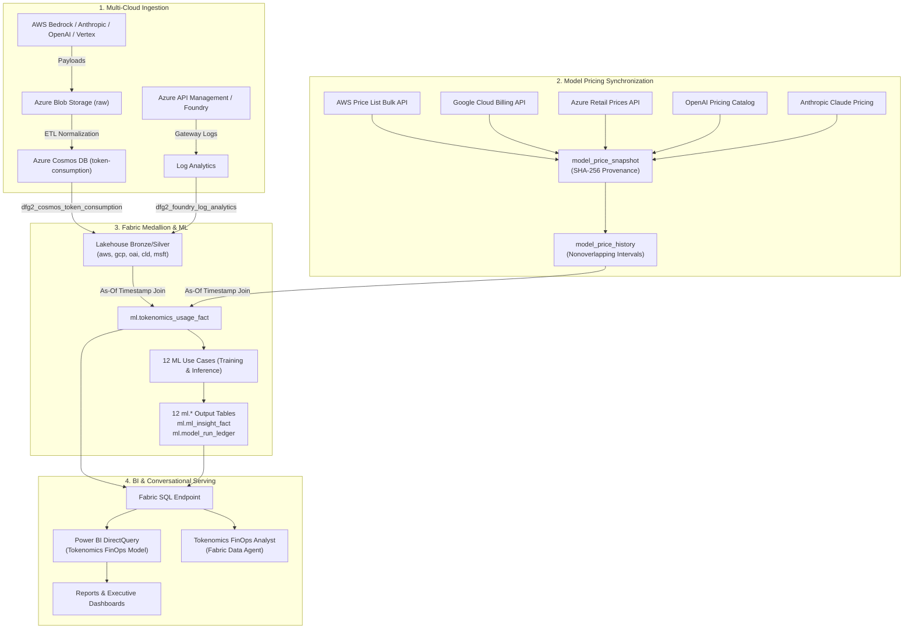
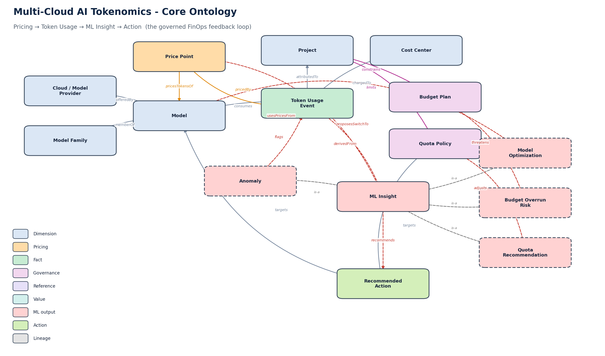
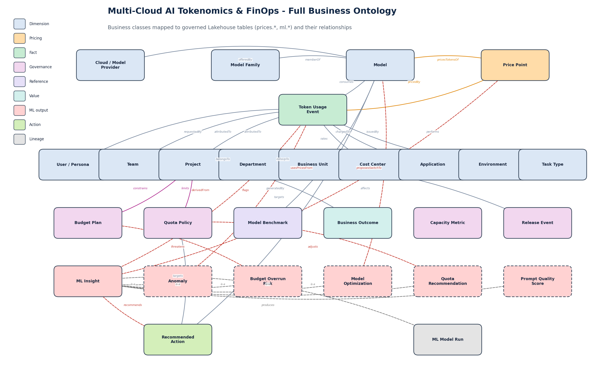
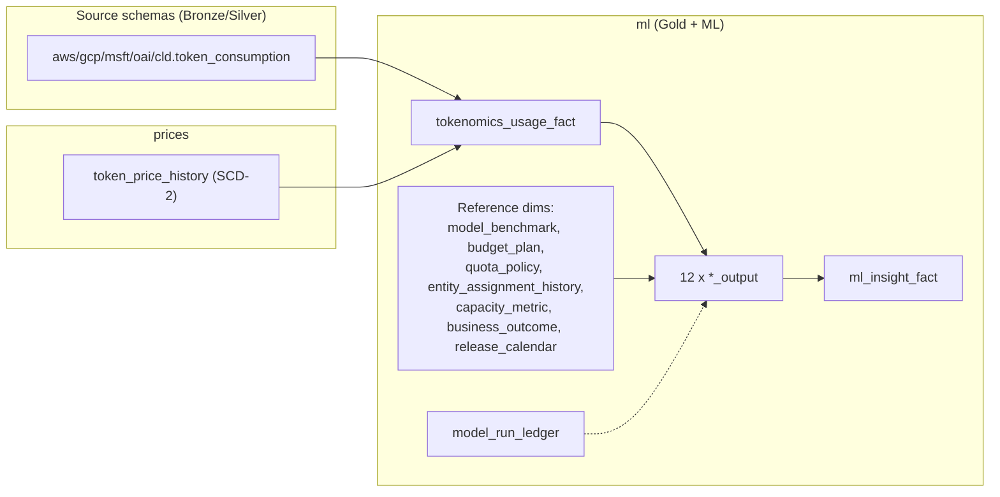

# Microsoft Fabric Multi-Cloud AI Tokenomics & FinOps Platform

Enterprise-grade multi-cloud AI Tokenomics, LLM model pricing normalization, predictive FinOps machine learning, and conversational data intelligence on **Microsoft Fabric**.

## Contents

- [Executive Summary & Multi-Cloud Tokenomics Use Case](#executive-summary--multi-cloud-tokenomics-use-case)
- [Architecture & Medallion Lifecycle](#architecture--medallion-lifecycle)
- [Business Context & Ontology](#business-context--ontology)
- [Direct URLs & Portals](#direct-urls--portals)
- [Multi-Cloud Model Pricing Engine](#multi-cloud-model-pricing-engine)
- [12 PySpark Machine Learning Use Cases](#12-pyspark-machine-learning-use-cases)
- [Fabric Lakehouse Schema & Semantic Model](#fabric-lakehouse-schema--semantic-model)
- [Power BI Semantic Model, Reports & Dashboards](#power-bi-semantic-model-reports--dashboards)
- [Ionic / Angular CostOps Web UI](#ionic--angular-costops-web-ui)
- [Fabric Data Agent & Configurable Prompt Library](#fabric-data-agent--configurable-prompt-library)
- [Security, Privacy & Governance](#security-privacy--governance)
- [Configuration & Deployment](#configuration--deployment)
- [Business Case & Value Proposition](#business-case--value-proposition)
- [References](#references)

---


```
  ┌──────────────────────────────────────────────────────────────────────────────────────────────────┐
  │                           Multi-Cloud AI Tokenomics & FinOps Platform                            │
  └──────────────────────────────────────────────────────────────────────────────────────────────────┘
            │                                 │                                  │
    [Multi-Cloud Ingestion]       [Dynamic Pricing Engine]           [Fabric Medallion Lakehouse]
    • AWS Bedrock                 • AWS Price List Bulk API          • Bronze / Silver Schemas:
    • GCP Vertex AI               • GCP Cloud Billing Catalog          aws, gcp, oai, cld, msft
    • Azure OpenAI / Foundry      • Azure Retail Prices API          • Gold ml.tokenomics_usage_fact
    • OpenAI Direct               • OpenAI & Anthropic Snapshots     • 12 PySpark ML Models (ml.*)
    • Anthropic Claude            • SHA-256 Provenance & As-Of Rate  • Fabric SQL Analytics Endpoint
            │                                 │                                  │
            └─────────────────────────────────┼──────────────────────────────────┘
                                              ▼
                        ┌──────────────────────────────────────────┐
                        │      Serving & Intelligence Layer        │
                        ├──────────────────────────────────────────┤
                        │ • Power BI DirectQuery Semantic Model    │
                        │ • FinOps Consumption & Cost Reports      │
                        │ • 12 ML Insights Predictive Dashboards   │
                        │ • Fabric Data Agent (FinOps Analyst)     │
                        │ • Ionic/Angular CostOps Web Portal       │
                        │ • Data-Driven Configurable Prompt Library│
                        └──────────────────────────────────────────┘
```

## Executive Summary & Multi-Cloud Tokenomics Use Case

Modern enterprise AI initiatives span multiple foundational model providers—including **AWS Bedrock** (Amazon Nova, Anthropic Claude on Bedrock, Meta Llama), **Google Cloud Vertex AI** (Gemini 2.5 Pro/Flash, Claude on Vertex), **Azure OpenAI & Microsoft Foundry** (GPT-5, GPT-4.1, o-series), **OpenAI Direct**, and **Anthropic Claude**. Each cloud provider maintains distinct pricing models, metering intervals, telemetry formats, caching discounts (prompt caching write/read), rate limits (TPM/RPM), and billing lag times. 

Without centralized governance, enterprise FinOps teams face severe visibility gaps:
- **Fragmented Metrics:** Inability to compare token efficiency and actual dollar cost across cloud providers for identical workloads.
- **Dynamic Pricing Complexity:** Model list prices fluctuate frequently, while enterprise agreements feature negotiated discount tiers that apply only within specific effective-date windows.
- **Attribution & Chargeback Deficits:** Cloud bills arrive aggregated at the subscription or account level, failing to allocate cost down to specific business units, departments, applications, projects, teams, or individual users.
- **Unchecked Budget Overruns & Inefficiencies:** Lack of automated anomaly detection, prompt bloat identification, and model downgrading opportunities (e.g., swapping a high-cost frontier model for an efficient mini/flash model on summarization tasks).

This platform solves multi-cloud tokenomics end-to-end on **Microsoft Fabric**:
1. **Multi-Cloud Ingestion & Cleansing:** Ingests raw telemetry from all 5 providers into Azure Blob Storage and normalizes records into Azure Cosmos DB with pseudonymized user hashing (`user_id_hash`), consistent schema tagging (`aws`, `gcp`, `oai`, `cld`, `msft`), and request/token metrics.
2. **Time-Series Model Pricing Synchronization:** Regularly polls published pricing APIs (AWS Bulk Price List, Google Cloud Billing, Azure Retail Prices, OpenAI, Anthropic), snapshots raw responses with cryptographic SHA-256 provenance hashes in `model_price_snapshot`, and builds contiguous non-overlapping `[effective_from, effective_to)` rate cards in `model_price_history` tracking input, cached input, cache write, and output token rates per million.
3. **Governed Fabric Medallion Architecture:** Stages multi-cloud streams into Lakehouse Bronze/Silver Delta tables, executes deterministic timestamp joins against effective pricing to generate `ml.tokenomics_usage_fact`, and preserves distinct measures for reported, market benchmark, negotiated, and billed actual costs.
4. **12 Production PySpark ML Notebooks:** Executes 12 dedicated use cases (each with paired Training/Feature-Engineering and Inference/Scoring notebooks) to predict budget overruns, detect cost anomalies, forecast spending, calculate agent ROI, score token and prompt efficiency, segment users, optimize model selection, and automate quota management.
5. **DirectQuery Power BI & Dashboards:** Surfaces 16 Lakehouse tables via the Fabric SQL endpoint directly to `Tokenomics FinOps Model`, Power BI reports, and executive dashboards.
6. **Ionic / Angular CostOps Portal & Fabric Data Agent Chat:** A responsive TypeScript web application featuring interactive tokenomics dashboards, Power BI report viewers, ML notebook insight explorers, model rate card comparison calculators, and an AI chat assistant connected to the **Fabric Data Agent** (`Tokenomics FinOps Analyst`) with a data-driven, configurable **Saved Prompt Library**.

> **Sister Repository:** For caller-delegated Microsoft Foundry and Copilot Studio On-Behalf-Of (OBO) gateway integration with Microsoft Fabric Lakehouse and Data Agents, see [Foundry-Fabric-OBO-Gateway](https://github.com/csdmichael/Foundry-Fabric-OBO-Gateway).

---

## Architecture & Medallion Lifecycle


The platform unifies all multi-cloud AI telemetry through a governed Medallion lifecycle:


1. **Raw Tier:** Immutable provider events from AWS Bedrock, GCP Vertex AI, OpenAI Direct, Anthropic Claude, and Azure API Management / Foundry land in Azure Blob Storage under `/tokenomics-raw/consumption/v1/{provider}/`.
2. **Bronze / Silver Tier:** Operational pipelines and Fabric Dataflows cleanse, deduplicate, and pseudonymize user identifiers into Cosmos DB (`token-consumption`) and stage records into provider-specific Lakehouse Delta tables (`aws`, `gcp`, `oai`, `cld`, `msft`).
3. **Gold FinOps Facts:** Fabric joins consumption timestamps with effective-dated rate cards from `model_price_history` into `ml.tokenomics_usage_fact`, producing audit-ready cost dimensions.
4. **Data Science & ML Output Tier:** 12 PySpark inference pipelines write predictions, health scores, ROI metrics, and recommendations strictly into `ml.*` output tables, recorded in `ml.ml_insight_fact` and tracked in `ml.model_run_ledger`.
5. **Consumption & Serving Tier:** The Fabric SQL endpoint serves Power BI DirectQuery semantic models, the Ionic/Angular UI, and conversational queries via the Fabric Data Agent.



---

## Business Context & Ontology

Beyond raw tables, the platform is organized around a **business ontology** - a semantic
layer that names the concepts a FinOps stakeholder actually reasons about (a *Provider*, a
*Model*, a *Price Point*, a *Token Usage Event*, a *Budget*, an *ML Insight*, a *Recommended
Action*) and the relationships between them. The ontology maps each business class to the
governed Lakehouse tables that back it (`prices.*`, `ml.*`) and the join keys that connect
them, so questions can be answered against *meaning* rather than physical tables. It is
defined declaratively in [`fabric/ontology/tokenomics-ontology.json`](https://github.com/csdmichael/FabricIQ-FoundryIQ-CostOps/blob/main/fabric/ontology/tokenomics-ontology.json).

### Core ontology - the governed FinOps feedback loop

The heart of the model is a closed loop: **Pricing → Token Usage → ML Insight → Action.**
Prices cost every usage event; the 12 ML algorithms derive insights from usage + prices;
each insight recommends a concrete, governed action (model switch, quota/rate-limit change,
reallocation, throttle guardrail) that targets a model, project, or policy.



### Full business ontology

The complete class map, grouped by category (dimension, pricing, fact, governance,
reference, value, ML output, action, lineage), mapped to the Lakehouse tables that back
each class.



### Key entities & properties

| Entity (class) | Backed by | Key properties | Purpose |
| --- | --- | --- | --- |
| **Provider** | `ml.tokenomics_usage_fact` | `source_code`, providerName | A cloud/model provider (AWS Bedrock, GCP Vertex, Azure OpenAI, OpenAI Direct, Anthropic Claude). |
| **Model Family / Model** | `ml.tokenomics_usage_fact` | `model_family`, `model_name`, `model_version` | The model (and version) that consumes tokens and is priced. |
| **Price Point** | `prices.token_price_history` | `effective_from/to`, `is_current`, `market_*`, `negotiated_*` per million | Effective-dated (SCD-2) token price - the **source of truth** for costing. |
| **Token Usage Event** | `ml.tokenomics_usage_fact` | `usage_date`, `input/output/total_tokens`, `market/negotiated/actual_cost_usd`, `quality_score` | The Gold fact: governed consumption attributed to the full org hierarchy. |
| **User / Team / Project / Dept / BU / Cost Center / Application** | usage fact + `ml.entity_assignment_history` | ids + `persona` | The organization hierarchy used for attribution and chargeback. |
| **Budget** | `ml.budget_plan` | `budget_usd`, `approved_tpm/rpm` | Per-project monthly budget and approved throughput. |
| **Quota** | `ml.quota_policy` | `current_tpm/rpm`, `minimum_headroom_pct` | Per-project, per-provider throughput quota. |
| **Benchmark** | `ml.model_benchmark` | `quality_score`, cost per million, `approved_for_production` | Quality/cost benchmark per model + task type. |
| **ML Insight** (12 subclasses) | `ml.ml_insight_fact` + `ml.*_output` | `use_case_key`, `risk_score`, `probability`, `predicted_cost_usd`, `estimated_savings_usd`, `recommendation` | A scored signal for an entity, produced by a PySpark algorithm. |
| **Recommended Action** | `GET /actions` (derived) | `category`, `severity`, `estimatedAnnualImpactUsd`, `changes` | The concrete, reviewable FinOps action that closes the loop. |
| **ML Model Run** | `ml.model_run_ledger` | `status`, `row_count`, `output_table`, `source_watermark` | Lineage of the training/inference run that produced insights. |

### Key relationships

| Relationship | Meaning | Type |
| --- | --- | --- |
| Model **offeredBy** Provider / **memberOf** Model Family | model taxonomy | association |
| Price Point **pricesTokensOf** Model | effective-dated price for a model | temporal |
| Token Usage Event **consumes** Model, **pricedBy** Price Point | usage costed by the price effective at the event date | temporal |
| Token Usage Event **attributedTo** Project/Team, **chargedTo** Cost Center | attribution & chargeback | association |
| Budget **constrains** Project · Quota **limits** Project@Provider | governance constraints | constraint |
| ML Insight **derivedFrom** Usage, **usesPricesFrom** Price Point, **recommends** Action | analytics → action | derivation |
| Model Optimization **proposesSwitchTo** Model · Quota Rec. **adjusts** Quota · Budget Overrun **threatens** Budget | concrete closed-loop actions | derivation |
| ML Model Run **produces** ML Insight | lineage | lineage |

---

## Direct URLs & Portals

| Surface | URL | Environment |
| --- | --- | --- |
| **CostOps UI (Production)** | [https://caldova-fabric-costops-ui.azurewebsites.net](https://caldova-fabric-costops-ui.azurewebsites.net) | Live Web Portal |
| **Tokenomics API (Base)** | [https://caldova-apim-westus.azure-api.net/fabric-tokenomics](https://caldova-apim-westus.azure-api.net/fabric-tokenomics) | FastAPI via APIM |
| **Tokenomics API — Swagger / OpenAPI** | [https://caldova-apim-westus.azure-api.net/fabric-tokenomics/docs](https://caldova-apim-westus.azure-api.net/fabric-tokenomics/docs) · [openapi.json](https://caldova-apim-westus.azure-api.net/fabric-tokenomics/openapi.json) | Interactive API docs |
| **APIM Gateway** | [https://caldova-apim-westus.azure-api.net](https://caldova-apim-westus.azure-api.net) | Private API Management |
| **Fabric Workspace** | [Fabric AI Tokenomics](https://app.fabric.microsoft.com/groups/1e14d1a0-d6cd-4810-a23e-094a58dae55e) | Microsoft Fabric |
| **Fabric Lakehouse** | [lh_tokenomics](https://app.fabric.microsoft.com/groups/1e14d1a0-d6cd-4810-a23e-094a58dae55e/lakehouses/2963b5a6-900d-4364-b141-16913bf4548b) | OneLake Delta Tables |
| **Power BI — Consumption Report** | [Tokenomics Consumption & Cost Analytics](https://app.powerbi.com/groups/1e14d1a0-d6cd-4810-a23e-094a58dae55e/reports/c6ced143-01f0-4200-bb43-6ab1d11c8f2d) | DirectQuery Report |
| **Power BI — Executive Dashboard** | [Tokenomics FinOps Executive Dashboard](https://app.powerbi.com/groups/1e14d1a0-d6cd-4810-a23e-094a58dae55e/dashboards/1ba0a93e-c712-4ca7-8b8a-901fc6867595) | Executive Dashboard |
| **Foundry Project** | `Tokenomics` under `foundry-fabric-costops` | Tokenomics FinOps Analyst agent |

> The Tokenomics API, APIM gateway, and Foundry data plane have public network access disabled; the
> Swagger/OpenAPI surface is reachable from within the private network or through the CostOps UI host.

---

## Multi-Cloud Model Pricing Engine

To ensure accurate, auditable cost allocation across changing cloud rate cards, model prices are fetched directly from published provider endpoints, hashed for provenance, and normalized into effective-dated rate tables.

### Pricing Sources & Protocols

| Cloud / Provider | Source Name | Endpoint URI | Type / Protocol | Auth Mode | Parser Contract |
| --- | --- | --- | --- | --- | --- |
| **AWS Bedrock (`aws`)** | AWS Price List Bulk API | `https://pricing.us-east-1.amazonaws.com/offers/v1.0/aws/AmazonBedrock/current/index.json` | Catalog REST API / JSON | Anonymous | `aws_bedrock_bulk` |
| **Google Cloud Vertex (`gcp`)** | Google Cloud Billing Catalog API | `https://cloudbilling.googleapis.com/v1/services` | Catalog REST API / JSON | API Key / OAuth 2.0 | `gcp_cloud_billing` |
| **Azure OpenAI (`msft`)** | Azure Retail Prices API | `https://prices.azure.com/api/retail/prices` | Public REST API / OData JSON | Anonymous | `azure_retail_prices` |
| **OpenAI Direct (`oai`)** | OpenAI API Pricing Catalog | `https://openai.com/api/pricing/` | Published Catalog Snapshot | Anonymous / Curated | `approved_snapshot` |
| **Anthropic Claude (`cld`)** | Anthropic Claude Pricing | `https://platform.claude.com/docs/en/about-claude/pricing` | Published Catalog Snapshot | Anonymous / Curated | `approved_snapshot` |

### Effective-Dated Rate Card Architecture

1. **Raw Snapshot (`model_price_snapshot`):** Stores complete raw JSON/HTML responses, HTTP headers, ingestion timestamps, and cryptographic SHA-256 hashes for immutable auditability.
2. **Normalized History (`model_price_history`):** Maintains non-overlapping intervals `[effective_from, effective_to)` per provider, model family, model name, and version with granular token metrics:
   - `input_token_price_per_million`
   - `cached_input_token_price_per_million` (prompt cache read)
   - `cache_write_token_price_per_million` (prompt cache write)
   - `output_token_price_per_million`
   - `market_price_usd` vs `negotiated_price_usd` (enterprise discount applied)
3. **Deterministic As-Of Joins:** When computing cost for any token event at timestamp $T$, the platform joins where $T \ge \text{effective\_from} \land (T < \text{effective\_to} \lor \text{effective\_to IS NULL})$, ensuring historical reproducibility even after price updates.

---

## 12 PySpark Machine Learning Use Cases

Under the Fabric workspace folder `ML/`, 12 distinct FinOps algorithms process Lakehouse data at scale using PySpark. Each use case features a paired **Training & Feature Engineering** notebook and an **Inference & Scoring** notebook, outputting results to dedicated `ml.*` tables:

| # | Use Case | Folder under `ML` | Training Notebook | Inference Notebook | Output Table |
|---|---|---|---|---|---|
| 01 | **Anomaly Detection** | `01 - Anomaly Detection` | `01 - Anomaly Detection - Training` | `01 - Anomaly Detection - Inference` | `ml.anomaly_detection_output` |
| 02 | **Cost Forecasting** | `02 - Cost Forecasting` | `02 - Cost Forecasting - Training` | `02 - Cost Forecasting - Inference` | `ml.cost_forecast_output` |
| 03 | **Cost Attribution & Chargeback** | `03 - Cost Attribution and Chargeback` | `03 - Cost Attribution and Chargeback - Training` | `03 - Cost Attribution and Chargeback - Inference` | `ml.cost_attribution_chargeback_output` |
| 04 | **User Segmentation** | `04 - User Segmentation` | `04 - User Segmentation - Training` | `04 - User Segmentation - Inference` | `ml.user_segmentation_output` |
| 05 | **Token Efficiency Scoring** | `05 - Token Efficiency Scoring` | `05 - Token Efficiency Scoring - Training` | `05 - Token Efficiency Scoring - Inference` | `ml.token_efficiency_output` |
| 06 | **Budget Overrun Prediction** | `06 - Budget Overrun Prediction` | `06 - Budget Overrun Prediction - Training` | `06 - Budget Overrun Prediction - Inference` | `ml.budget_overrun_output` |
| 07 | **Model Optimization Engine** | `07 - Model Optimization Recommendation Engine` | `07 - Model Optimization Recommendation Engine - Training` | `07 - Model Optimization Recommendation Engine - Inference` | `ml.model_optimization_output` |
| 08 | **Agent ROI Analytics** | `08 - Agent ROI Analytics` | `08 - Agent ROI Analytics - Training` | `08 - Agent ROI Analytics - Inference` | `ml.agent_roi_output` |
| 09 | **Intelligent Quota Management** | `09 - Intelligent Quota Management` | `09 - Intelligent Quota Management - Training` | `09 - Intelligent Quota Management - Inference` | `ml.quota_management_output` |
| 10 | **Prompt Quality Analytics** | `10 - Prompt Quality Analytics` | `10 - Prompt Quality Analytics - Training` | `10 - Prompt Quality Analytics - Inference` | `ml.prompt_quality_output` |
| 11 | **Capacity Planning** | `11 - Capacity Planning` | `11 - Capacity Planning - Training` | `11 - Capacity Planning - Inference` | `ml.capacity_planning_output` |
| 12 | **Executive Adoption Scorecard** | `12 - Executive AI Adoption Scorecard` | `12 - Executive AI Adoption Scorecard - Training` | `12 - Executive AI Adoption Scorecard - Inference` | `ml.executive_adoption_output` |

### What each algorithm does, the features it uses, and how to act on the output

Every inference notebook writes to the common `ml.*_output` schema
(`entity_type`, `entity_id`, `team_id`, `project_id`, `model_name`, `risk_score`,
`probability`, `predicted_cost_usd`, `estimated_savings_usd`, `recommendation`, …)
and is rolled up into `ml.ml_insight_fact`. The **FinOps Action Center** in the UI
reads these tables live and turns each signal into a concrete, reviewable action —
model switching, APIM token/rate-limit changes, quota reallocation, throttle
guardrails, prompt trimming, and chargeback — closing the analytics feedback loop.

#### 01 · Anomaly Detection → `ml.anomaly_detection_output`
- **What it does:** Continuously watches every provider's token stream and flags abnormal spikes, runaway agent loops, and sudden context-window blow-ups before they become a surprise invoice.
- **Algorithm:** Isolation Forest + Seasonal-Trend Decomposition (STL) on hourly token and cost series.
- **Highest-impact features:** Prompt tokens/hour vs. seasonal baseline (highest), request retry count, context-window growth, RPM deviation.
- **Output:** One row per flagged entity/window with `risk_score`, `probability`, and the offending metric vs. its STL baseline.
- **How to use it:** Route the top anomalies into an APIM throttle guardrail (`rate-limit-by-key`) for the offending team/subscription during the spike window and open a review ticket.

#### 02 · Cost Forecasting → `ml.cost_forecast_output`
- **What it does:** Projects multi-cloud AI spend 30/90 days out with confidence bands so Finance sees overruns against the annual commitment before they happen.
- **Algorithm:** Prophet + AutoARIMA time-series forecasting with weekly/monthly seasonality and onboarding-velocity regressors.
- **Highest-impact features:** Daily negotiated-cost trend (highest), team onboarding velocity, seasonality, model-mix shift.
- **Output:** Forecasted daily/period cost with lower/upper 95% confidence bounds and MAPE accuracy per scope.
- **How to use it:** When the upper band breaches budget, trigger a capacity or reallocation plan proactively instead of reactively.

#### 03 · Cost Attribution & Chargeback → `ml.cost_attribution_chargeback_output`
- **What it does:** Attributes every token invoice down to Department, Project, Cost Center, and Environment so no spend is unallocated and chargeback is defensible.
- **Algorithm:** Deterministic attribution join over hashed sessions and gateway client headers with a hierarchical business-entity rollup.
- **Highest-impact features:** Gateway client/subscription id (highest), hashed user→department mapping, project/cost-center tags, environment.
- **Output:** Fully attributed cost per entity with an attributed-share percentage and any residual unallocated margin.
- **How to use it:** Publish monthly chargeback statements per cost center and reallocate shared-platform cost by observed token share.

#### 04 · User Segmentation → `ml.user_segmentation_output`
- **What it does:** Groups users into behavioural personas by token intensity, tool usage, and prompt depth so model routing and enablement can be tailored per cohort.
- **Algorithm:** K-Means (silhouette-tuned k) and DBSCAN for outlier personas on standardized behavioural features.
- **Highest-impact features:** Tokens per active day (highest), tool-call/agent usage ratio, average prompt depth, frontier-model share.
- **Output:** Each user assigned to a persona cluster with intensity/tool-usage centroids and cohort token share.
- **How to use it:** Apply persona-based model routing — move heavy researchers to large-context efficient models, reserve frontier models for agent builders.

#### 05 · Token Efficiency Scoring → `ml.token_efficiency_output`
- **What it does:** Scores how much useful business outcome each application gets per token, exposing waste from low cache reuse and bloated tool calls.
- **Algorithm:** Weighted multi-factor composite score (cost-per-task, tokens-per-outcome, cache-hit ratio, tool-call efficiency) with percentile ranking.
- **Highest-impact features:** Cache-read hit ratio (highest), tokens per completed task, tool-call success efficiency, output/input ratio.
- **Output:** Per-application efficiency score (0–100) with contributing sub-factors and ranking vs. the enterprise median.
- **How to use it:** Target the lowest-scoring apps first: enable prompt caching and trim context to lift the score and cut input-token spend.

#### 06 · Budget Overrun Prediction → `ml.budget_overrun_output`
- **What it does:** Predicts which projects will blow past their quarterly token allocation, and by how much, while there is still time to act.
- **Algorithm:** Gradient Boosted Trees (XGBoost) on burn-rate and team-growth features.
- **Highest-impact features:** Current burn rate vs. allocation (highest), team expansion velocity, agent adoption curve, workload seasonality.
- **Output:** Per-project overrun probability, projected overage in USD, and the expected breach date.
- **How to use it:** For high-risk projects, reallocate unused quota from safe projects or drop non-critical workloads to a cheaper tier before the breach date.

#### 07 · Model Optimization Recommendation Engine → `ml.model_optimization_output`
- **What it does:** Finds workloads on expensive frontier models that a cheaper model can serve at equal quality, and quantifies the savings of switching.
- **Algorithm:** Task classifier over prompt embeddings mapped against a model performance/price benchmark matrix.
- **Highest-impact features:** Task type/prompt-embedding class (highest), benchmark quality-parity score, current model price, workload token volume.
- **Output:** Per-workload current model, recommended target model, quality-parity score, and estimated annualized savings.
- **How to use it:** Apply the recommended model map to the routing layer for zero-quality-loss workloads (e.g. summarization → mini/Nova tier).

#### 08 · Agent ROI Analytics → `ml.agent_roi_output`
- **What it does:** Ties token cost to real business outcomes (PRs merged, tickets resolved, hours saved) so you fund agents that pay for themselves.
- **Algorithm:** Cost-to-outcome correlation and ROI ratio modeling per agent/business unit.
- **Highest-impact features:** Outcome events per 1K tokens (highest), hours automated per agent, token cost per outcome, business-unit value weighting.
- **Output:** Per-agent ROI ratio, net monthly value, and the outcome metrics that drove it.
- **How to use it:** Reallocate budget toward the highest-ROI agents and put low-ROI agents on a cheaper tier or a review list.

#### 09 · Intelligent Quota Management → `ml.quota_management_output`
- **What it does:** Predicts TPM/RPM exhaustion before the gateway returns 429s and rebalances quota across teams.
- **Algorithm:** Short-horizon TPM/RPM demand forecasting with a capacity-pool constraint solver.
- **Highest-impact features:** Peak TPM vs. assigned quota (highest), upcoming release/onboarding calendar, historical 429 near-miss rate, idle headroom.
- **Output:** Per-team recommended TPM/RPM adjustments, reclaimable headroom, and predicted throttling events avoided.
- **How to use it:** Apply the recommended `rate-limit-by-key` / TPM changes in APIM ahead of peak, reclaiming idle quota from over-provisioned teams.

#### 10 · Prompt Quality Analytics → `ml.prompt_quality_output`
- **What it does:** Scores prompt hygiene — bloated system instructions, repeated context, high retry loops — and quantifies the tokens you can safely cut.
- **Algorithm:** Prompt feature extraction with repetition/entropy scoring and retry-pattern detection.
- **Highest-impact features:** Repeated system-instruction tokens (highest), context-window utilization, retry count per prompt, cacheable repetition ratio.
- **Output:** Per-prompt/app bloat percentage, reducible token count, and estimated annual savings from trimming.
- **How to use it:** Trim and cache the worst-offending pipelines (e.g. RAG system prompts) to cut input-token spend without changing model or output.

#### 11 · Capacity Planning → `ml.capacity_planning_output`
- **What it does:** Forecasts infrastructure needs — gateway throughput, regional model capacity, vector indices — across a 12-month horizon so provisioning stays ahead of growth.
- **Algorithm:** Long-horizon capacity forecasting with regional load distribution and commitment-attainment modeling.
- **Highest-impact features:** Projected peak gateway RPS (highest), regional traffic distribution, multi-region growth multiplier, MACC commitment burn.
- **Output:** Forecasted capacity requirements per region with recommended provisioning dates and commitment-attainment track.
- **How to use it:** Schedule gateway/model capacity provisioning ahead of the forecasted breach date and steer traffic to keep MACC attainment on track.

#### 12 · Executive AI Adoption Scorecard → `ml.executive_adoption_output`
- **What it does:** Rolls the whole program into an executive scorecard — adoption, cost per active employee, negotiated savings, team rankings — for board-level FinOps reporting.
- **Algorithm:** Weighted KPI aggregation and index scoring across adoption, efficiency, and savings dimensions.
- **Highest-impact features:** Active-user ratio (highest), cost per active employee, negotiated vs. market savings rate, team adoption ranking.
- **Output:** Enterprise adoption index with per-department rankings, cost-per-user, and cumulative savings.
- **How to use it:** Target enablement where adoption lags and use the scorecard to govern the program and justify continued investment.

---

## Fabric Lakehouse Schema & Semantic Model

The Lakehouse follows a **medallion** layout across three schema groups, all exposed to
Power BI and the API through the Fabric **SQL analytics endpoint** (DirectQuery):

- **Source (Bronze/Silver) schemas** - one per provider: `aws`, `gcp`, `msft`, `oai`, `cld` - each with a `token_consumption` table.
- **Gold + ML schema** - `ml`: the conformed fact, reference/dimension tables, and the 12 ML output tables.
- **Pricing schema** - `prices`: the governed, effective-dated price history (source of truth for costing).



### Source: `<provider>.token_consumption`
Raw governed consumption events per provider (privacy-preserving; user ids are hashed).

| Column | Type | Purpose |
| --- | --- | --- |
| `event_id`, `event_ts`, `usage_date` | string / datetime / date | Event identity and time. |
| `source_code`, `region`, `account_id` | string | Provider, region, billing account. |
| `model_family`, `model_name`, `model_version` | string | The model invoked. |
| `user_id_hash`, `team_id`, `department_id`, `business_unit_id`, `cost_center_id`, `project_id`, `application_id`, `agent_id` | string | Full attribution hierarchy. |
| `environment`, `task_type`, `prompt_template_id` | string | Workload context. |
| `input_tokens`, `cached_input_tokens`, `cache_write_tokens`, `output_tokens`, `total_tokens`, `context_window_tokens` | int | Token counters. |
| `tool_call_count`, `tool_success_count`, `retry_count`, `failure_count`, `latency_ms`, `status_code`, `is_stream` | int/bool | Quality & reliability signals. |
| `reported_cost_usd`, `tasks_completed`, `hours_saved`, `tickets_reduced`, `code_generated_lines`, `quality_score` | double | Provider-reported cost and business outcomes. |

### Gold fact: `ml.tokenomics_usage_fact`
The conformed, priced fact that every report and ML model reads.

| Column | Type | Purpose |
| --- | --- | --- |
| `event_id`, `event_ts`, `usage_date` | string / datetime / date | Grain: one governed usage event. |
| `source_code`, `model_family`, `model_name`, `model_version` | string | Priced model dimension. |
| `user_id_hash`, `team_id`, `department_id`, `business_unit_id`, `project_id`, `cost_center_id`, `application_id`, `environment`, `task_type` | string | Attribution dimensions. |
| `request_count`, `input_tokens`, `cached_input_tokens`, `output_tokens`, `total_tokens` | int | Volume measures. |
| `reported_cost_usd`, `market_cost_usd`, `negotiated_cost_usd`, `actual_cost_usd` | double | Distinct cost metrics (provider-reported, market list, negotiated, Azure-billed). |
| `tasks_completed`, `quality_score` | int/double | Outcome & quality. |

### Pricing: `prices.token_price_history` (source of truth)
Effective-dated (SCD-2) token prices maintained by the pricing Azure Function; the API joins
usage to the price effective at each event date to compute total consumption cost.

| Column | Type | Purpose |
| --- | --- | --- |
| `price_id`, `snapshot_id` | string | Price row identity + provenance snapshot. |
| `source_code`, `model_family`, `model_name`, `model_version` | string | The model priced. |
| `effective_from`, `effective_to`, `is_current` | datetime / bool | Validity window of this price (SCD-2). |
| `currency`, `unit_scale` | string / int | USD, per-million-tokens. |
| `market_input_usd_per_million`, `market_cached_input_usd_per_million`, `market_cache_write_usd_per_million`, `market_output_usd_per_million` | double | Public list rates. |
| `negotiated_input_usd_per_million`, `negotiated_cached_input_usd_per_million`, `negotiated_cache_write_usd_per_million`, `negotiated_output_usd_per_million` | double | Enterprise-negotiated rates. |
| `source_type`, `source_name`, `source_uri`, `source_payload_sha256` | string | Auditable pricing provenance. |

### Reference / dimension tables (`ml.*`)

| Table | Key columns | Purpose |
| --- | --- | --- |
| `ml.model_price_snapshot` | `observed_at`, model, `*_usd_per_million`, `source_payload_sha256` | Raw as-of price observations (audit trail behind `prices`). |
| `ml.model_benchmark` | model, `task_type`, `quality_score`, cost per million, `approved_for_production` | Quality/cost benchmark powering model-optimization. |
| `ml.budget_plan` | `project_id`, `fiscal_month`, `budget_usd`, `approved_tpm/rpm` | Per-project budgets & approved throughput. |
| `ml.quota_policy` | `project_id`, `source_code`, `current_tpm/rpm`, `minimum_headroom_pct` | Current quota per project/provider. |
| `ml.entity_assignment_history` | `user_id_hash`, `persona`, org ids, `effective_from/to`, `is_current` | SCD-2 user→persona→org assignment. |
| `ml.capacity_metric` | `event_ts`, `service`, `region`, `metric_value`, `capacity_limit` | Infrastructure capacity signals. |
| `ml.business_outcome` | `task_id`, `project_id`, `outcome_type`, `outcome_count`, `estimated_business_value_usd` | Outcomes for ROI analytics. |
| `ml.release_calendar` | `project_id`, `release_date`, `expected_usage_multiplier`, `release_type` | Planned releases for capacity/quota forecasting. |

### ML outputs (`ml.*_output`, `ml.ml_insight_fact`, `ml.model_run_ledger`)
All 12 output tables and the unified `ml.ml_insight_fact` share one common schema:

| Column | Type | Purpose |
| --- | --- | --- |
| `run_id`, `scored_at`, `event_date` | string / datetime / date | Scoring run + as-of date. |
| `use_case_key`, `use_case_name` | string | Which of the 12 algorithms produced the row. |
| `entity_type`, `entity_id` + org/model columns | string | The scored entity (team, project, model, user...). |
| `metric_name`, `metric_value`, `metric_unit` | string / double | The headline metric for the insight. |
| `risk_score`, `probability`, `predicted_cost_usd`, `estimated_savings_usd` | double | Scored signal used by the Action Center. |
| `recommendation`, `scoring_model_version`, `source_lineage` | string | Human recommendation + lineage. |

`ml.model_run_ledger` tracks each notebook run (`run_id`, `use_case_key`, `status`,
`row_count`, `output_table`, `source_watermark`) for observability and incremental scoring.

### Semantic model - `Tokenomics FinOps Model`
A **DirectQuery** Power BI model over the SQL endpoint (no data copy - always live). It
surfaces four core semantic tables plus one table per ML algorithm:

- **Usage** → `ml.tokenomics_usage_fact` (measures: Total Tokens, Market/Negotiated/Actual Cost, Savings, Cost per Request).
- **Price History** → `prices.token_price_history` (measures: Market/Negotiated Input & Output Rate).
- **ML Insights** → `ml.ml_insight_fact` (measures: Output Rows, Avg Risk/Probability, Predicted Cost, Estimated Savings).
- **Model Runs** → `ml.model_run_ledger` (measures: Run/Successful/Failed Runs, Rows Scored).
- **ML 01..12** → each `ml.*_output` for dedicated per-algorithm report pages.

Tables are conformed on shared business keys (`source_code`, `model_name`/`model_version`,
`team_id`, `project_id`, `cost_center_id`, `usage_date`) - the same keys defined in the
[ontology](#business-context--ontology) - so slicers filter consistently across usage,
pricing, and ML pages.

---

## Power BI Semantic Model, Reports & Dashboards

The Fabric SQL analytics endpoint exposes all 16 Lakehouse tables (4 foundation tables + 12 ML output tables) via DirectQuery:

- **Semantic Model:** `Tokenomics FinOps Model`
- **Reports:**
  - `Tokenomics Consumption and Cost Analytics`: Executive overview, multi-level expandable matrices (User > Model Family > Provider > Model > Version and Provider > Model Family > Model > Version > User), usage & cost explorer, chargeback & cross-team allocation, and model economics.
  - `Tokenomics ML Insights`: Comprehensive 14-page report covering portfolio metrics and dedicated deep-dive pages for each of the 12 ML algorithm outputs.
- **Service Dashboards:**
  - `Tokenomics FinOps Executive Dashboard`
  - `Tokenomics ML Operations Dashboard`

---

## Ionic / Angular CostOps Web UI

A full-featured, responsive Angular application built with standalone components and Ionic controls:

1. **Token Command Center (Overview):** Multi-cloud KPI cards (Total Tokens, Billed Cost, Negotiated Savings, P95 Latency, Cost per Request), volume & cost trend charts, provider market share, and operational health meters.
2. **Cost Allocation & Chargeback:** Cross-team, project, department, and business unit cost attribution tables with percentage breakdown and budget tracking.
3. **Multi-Cloud Model Pricing Catalog:** Live rate cards across AWS Bedrock, GCP Vertex AI, Azure OpenAI, OpenAI Direct, and Anthropic Claude with pricing calculator and enterprise discount comparisons.
4. **Power BI Report Viewer:** Embedded views and direct navigation for Fabric Power BI reports and dashboards with date/time, department, and provider slicers.
5. **12 ML Insight Dashboards:** Interactive visualization of all 12 PySpark ML use cases (anomaly flags, budget overrun risk probabilities, prompt quality scores, model optimization downgrade savings, and quota recommendations).
6. **FinOps Action Center (closed feedback loop):** Turns the live `ml.*_output` tables into concrete, reviewable actions — model switching, APIM token/rate-limit changes, quota reallocation, throttle guardrails, prompt trimming, and chargeback — each with the source algorithm, a current→proposed change preview, projected impact, and an exportable plan. Served from the `GET /actions` API; nothing is hard-coded.
7. **ML Guide (help):** Reference page explaining all 12 algorithms — what each does, the technique it uses, its highest-impact features, the output it produces, and how to turn that output into action.
8. **Fabric Data Agent Chat & Saved Prompt Library:** Conversational AI interface communicating with the Fabric Data Agent, backed by a categorized, data-driven prompt library.

---

## Fabric Data Agent & Configurable Prompt Library

The CostOps portal integrates directly with the **Fabric Data Agent** (`Tokenomics FinOps Analyst`). Users can execute natural language queries against governed Lakehouse Delta tables and receive structured analysis, SQL/DAX breakdowns, and actionable recommendations.

### Configurable Prompt Categories in Library

- **Executive & FinOps Summary:**
  - *"Summarize multi-cloud AI token consumption and spend across AWS, Azure, GCP, OpenAI, and Anthropic over the last 30 days."*
  - *"Show executive KPI scorecard for AI adoption, cost per active user, and total negotiated savings."*
- **Cost Anomalies & Budget Overruns:**
  - *"Identify all projects with an 80%+ probability of exceeding their quarterly token budget."*
  - *"Highlight recent token volume anomalies and spike events grouped by team and cost center."*
- **Model Optimization & Downgrade Recommendations:**
  - *"Which high-cost frontier model workloads (GPT-5 / Claude Opus) can be downgraded to mini/flash models to achieve 40%-80% cost savings?"*
  - *"Calculate annualized cost savings if developer code generation tasks are shifted to Amazon Nova or Gemini 2.5 Flash."*
- **Prompt Quality & Efficiency:**
  - *"Identify prompts with context windows exceeding 30,000 tokens and low completion efficiency."*
  - *"Analyze cache hit ratios across OpenAI and Claude workloads to optimize prompt caching strategies."*
- **Quota & Capacity Planning:**
  - *"Recommend TPM/RPM quota increases based on 90-day team growth velocity and release calendars."*
  - *"Forecast regional APIM and model throughput requirements for next quarter's MACC commitment."*

---

## Security, Privacy & Governance

- **Zero Cleartext Credentials:** All cloud keys, service principal secrets, and connection strings are retrieved from Azure Key Vault or Microsoft Entra ID at runtime.
- **User Pseudonymization:** User identifiers are hashed using SHA-256 (`user_id_hash`) before persisting into Cosmos DB and Fabric Lakehouse tables.
- **Separate Cost Metrics:** Provider-reported cost, market list price, negotiated discount cost, and billed actual cost are preserved in separate schema columns to prevent misattribution.
- **Network Isolation:** Azure App Service UI and APIM gateway operate with private endpoints and strict VNet integration.

---

## Configuration & Deployment

Deployment configuration is centralized in [config/deployment.json](config/deployment.json).

### Running Local Validation & Tests

```powershell
# Validate all Tokenomics contracts, Bicep, Terraform, UI build, and Python scripts
pwsh scripts/validate.ps1 -DeploymentReady

# Run UI tests in headless mode
npm test --prefix ui -- --watch=false

# Test data generator and Power BI generators
npm test --prefix scripts/tokenomics

# Verify Python Delta schemas
python scripts/test/test_delta_schema.py
python scripts/test/test_onelake_swap.py
```

### Deploying the Multi-Cloud Tokenomics Platform

```powershell
# 1. Provision Tokenomics Fabric Workspace, Lakehouse, and Dataflows
pwsh scripts/provision-tokenomics-fabric.ps1

# 2. Seed Multi-Cloud Synthetic Ingestion Data
pwsh scripts/seed-tokenomics-data.ps1 -RepositoryCommit $(git rev-parse HEAD)

# 3. Synchronize and Materialize Delta Tables in OneLake
pwsh scripts/sync-tokenomics-to-fabric.ps1

# 4. Publish Power BI Semantic Model, Reports, and Dashboards
pwsh scripts/publish-tokenomics-powerbi.ps1

# 5. Provision the Foundry "Tokenomics" project + FinOps Analyst agent
#    (Foundry agent -> APIM -> Fabric Data Agent). Run in-network.
python scripts/provision-tokenomics-foundry.py            # or --what-if to validate

# 6. Run the Tokenomics FastAPI service (live Fabric Lakehouse data)
pip install -r api/requirements.txt
uvicorn app.main:app --app-dir api --port 8080

# 7. Build and Deploy Angular/Ionic CostOps UI to Azure App Service
pwsh scripts/build-ui.ps1
```

### Live serving architecture

```
Angular/Ionic CostOps UI
  ├── GET  /summary,/pricing,/prompts  ─┐
  ├── POST /chat  ──────────────────────┤   FastAPI (api/) ── Fabric SQL endpoint (lh_tokenomics)
  ├── GET  /powerbi/embed ──────────────┘        │
  └── Power BI embed (user-owns-data) ──> app.powerbi.com (DirectQuery on OneLake)
                                                  │
   Chat: UI ─> FastAPI /chat ─> Foundry "Tokenomics" agent ─> APIM ─> Fabric Data Agent
```

The UI contains **no mock data**: dashboard, pricing, prompts, chat, and Power BI
embeds are all sourced live. The FastAPI service and Foundry provisioning are fully
config-driven from [`config/deployment.json`](config/deployment.json) and
[`config/tokenomics-prompts.json`](config/tokenomics-prompts.json).

---

## Business Case & Value Proposition

A full enterprise business case and value proposition are maintained under
[`docs/business-case/`](docs/business-case):

- [Business Case](docs/business-case/business-case.md) — problem, solution, value model, and savings levers.
- [Value Proposition](docs/business-case/value-proposition.md) — value pillars, governance modes, and stakeholder value.
- [Executive Value & Architecture deck](docs/business-case) — the auditable planning model (spend scenarios, savings levers, and 90-day pilot).

The **Business Value Showcase** is also available in the CostOps portal (Showcase tab): a value-proposition
gadget, a selectable spend-scenario value model with savings levers and auditable assumptions, features,
the end-to-end architecture diagram, and try-it links (user guide, setup guide, business case, and
source-access request).

## Setup & User Guide

- [Setup & deployment guide](docs/setup/README.md) — provision Fabric, Power BI, Foundry, APIM, and the CostOps portal in your own Azure environment.
- [CostOps user guide](docs/user-guide/README.md) — a screen-by-screen walkthrough of the portal ([PDF](docs/user-guide/AI-Tokenomics-User-Guide.pdf)).

---

## References

- [Setup & deployment guide](docs/setup/README.md)
- [CostOps user guide](docs/user-guide/README.md)
- [Microsoft Fabric Documentation](https://learn.microsoft.com/fabric/)
- [Microsoft Fabric Data Agent Overview](https://learn.microsoft.com/fabric/data-science/data-agent-overview)
- [Power BI DirectQuery on Fabric Lakehouse](https://learn.microsoft.com/power-bi/connect-data/desktop-directquery-about)
- [AWS Bedrock Pricing Catalog](https://pricing.us-east-1.amazonaws.com/offers/v1.0/aws/AmazonBedrock/current/index.json)
- [Google Cloud Billing Catalog API](https://cloudbilling.googleapis.com/v1/services)
- [Azure Retail Prices API](https://prices.azure.com/api/retail/prices)
- [OpenAI API Pricing](https://openai.com/api/pricing/)
- [Anthropic Claude Pricing](https://platform.claude.com/docs/en/about-claude/pricing)
