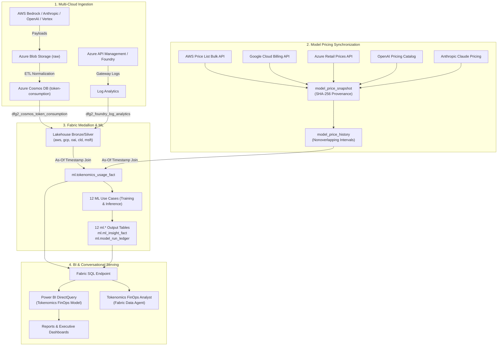

# Microsoft Fabric Multi-Cloud AI Tokenomics & FinOps Platform

Enterprise-grade multi-cloud AI Tokenomics, LLM model pricing normalization, predictive FinOps machine learning, and conversational data intelligence on **Microsoft Fabric**.

## Contents

- [Executive Summary & Multi-Cloud Tokenomics Use Case](#executive-summary--multi-cloud-tokenomics-use-case)
- [Architecture & Medallion Lifecycle](#architecture--medallion-lifecycle)
- [Direct URLs & Portals](#direct-urls--portals)
- [Multi-Cloud Model Pricing Engine](#multi-cloud-model-pricing-engine)
- [12 PySpark Machine Learning Use Cases](#12-pyspark-machine-learning-use-cases)
- [Power BI Semantic Model, Reports & Dashboards](#power-bi-semantic-model-reports--dashboards)
- [Ionic / Angular CostOps Web UI](#ionic--angular-costops-web-ui)
- [Fabric Data Agent & Configurable Prompt Library](#fabric-data-agent--configurable-prompt-library)
- [Security, Privacy & Governance](#security-privacy--governance)
- [Configuration & Deployment](#configuration--deployment)
- [Business Case & Value Proposition](#business-case--value-proposition)
- [References](#references)

---


```
  ┌──────────────────────────────────────────────────────────────────────────────────────────────────┐
  │                           Multi-Cloud AI Tokenomics & FinOps Platform                            │
  └──────────────────────────────────────────────────────────────────────────────────────────────────┘
            │                                 │                                  │
    [Multi-Cloud Ingestion]       [Dynamic Pricing Engine]           [Fabric Medallion Lakehouse]
    • AWS Bedrock                 • AWS Price List Bulk API          • Bronze / Silver Schemas:
    • GCP Vertex AI               • GCP Cloud Billing Catalog          aws, gcp, oai, cld, msft
    • Azure OpenAI / Foundry      • Azure Retail Prices API          • Gold ml.tokenomics_usage_fact
    • OpenAI Direct               • OpenAI & Anthropic Snapshots     • 12 PySpark ML Models (ml.*)
    • Anthropic Claude            • SHA-256 Provenance & As-Of Rate  • Fabric SQL Analytics Endpoint
            │                                 │                                  │
            └─────────────────────────────────┼──────────────────────────────────┘
                                              ▼
                        ┌──────────────────────────────────────────┐
                        │      Serving & Intelligence Layer        │
                        ├──────────────────────────────────────────┤
                        │ • Power BI DirectQuery Semantic Model    │
                        │ • FinOps Consumption & Cost Reports      │
                        │ • 12 ML Insights Predictive Dashboards   │
                        │ • Fabric Data Agent (FinOps Analyst)     │
                        │ • Ionic/Angular CostOps Web Portal       │
                        │ • Data-Driven Configurable Prompt Library│
                        └──────────────────────────────────────────┘
```

## Executive Summary & Multi-Cloud Tokenomics Use Case

Modern enterprise AI initiatives span multiple foundational model providers—including **AWS Bedrock** (Amazon Nova, Anthropic Claude on Bedrock, Meta Llama), **Google Cloud Vertex AI** (Gemini 2.5 Pro/Flash, Claude on Vertex), **Azure OpenAI & Microsoft Foundry** (GPT-5, GPT-4.1, o-series), **OpenAI Direct**, and **Anthropic Claude**. Each cloud provider maintains distinct pricing models, metering intervals, telemetry formats, caching discounts (prompt caching write/read), rate limits (TPM/RPM), and billing lag times. 

Without centralized governance, enterprise FinOps teams face severe visibility gaps:
- **Fragmented Metrics:** Inability to compare token efficiency and actual dollar cost across cloud providers for identical workloads.
- **Dynamic Pricing Complexity:** Model list prices fluctuate frequently, while enterprise agreements feature negotiated discount tiers that apply only within specific effective-date windows.
- **Attribution & Chargeback Deficits:** Cloud bills arrive aggregated at the subscription or account level, failing to allocate cost down to specific business units, departments, applications, projects, teams, or individual users.
- **Unchecked Budget Overruns & Inefficiencies:** Lack of automated anomaly detection, prompt bloat identification, and model downgrading opportunities (e.g., swapping a high-cost frontier model for an efficient mini/flash model on summarization tasks).

This platform solves multi-cloud tokenomics end-to-end on **Microsoft Fabric**:
1. **Multi-Cloud Ingestion & Cleansing:** Ingests raw telemetry from all 5 providers into Azure Blob Storage and normalizes records into Azure Cosmos DB with pseudonymized user hashing (`user_id_hash`), consistent schema tagging (`aws`, `gcp`, `oai`, `cld`, `msft`), and request/token metrics.
2. **Time-Series Model Pricing Synchronization:** Regularly polls published pricing APIs (AWS Bulk Price List, Google Cloud Billing, Azure Retail Prices, OpenAI, Anthropic), snapshots raw responses with cryptographic SHA-256 provenance hashes in `model_price_snapshot`, and builds contiguous non-overlapping `[effective_from, effective_to)` rate cards in `model_price_history` tracking input, cached input, cache write, and output token rates per million.
3. **Governed Fabric Medallion Architecture:** Stages multi-cloud streams into Lakehouse Bronze/Silver Delta tables, executes deterministic timestamp joins against effective pricing to generate `ml.tokenomics_usage_fact`, and preserves distinct measures for reported, market benchmark, negotiated, and billed actual costs.
4. **12 Production PySpark ML Notebooks:** Executes 12 dedicated use cases (each with paired Training/Feature-Engineering and Inference/Scoring notebooks) to predict budget overruns, detect cost anomalies, forecast spending, calculate agent ROI, score token and prompt efficiency, segment users, optimize model selection, and automate quota management.
5. **DirectQuery Power BI & Dashboards:** Surfaces 16 Lakehouse tables via the Fabric SQL endpoint directly to `Tokenomics FinOps Model`, Power BI reports, and executive dashboards.
6. **Ionic / Angular CostOps Portal & Fabric Data Agent Chat:** A responsive TypeScript web application featuring interactive tokenomics dashboards, Power BI report viewers, ML notebook insight explorers, model rate card comparison calculators, and an AI chat assistant connected to the **Fabric Data Agent** (`Tokenomics FinOps Analyst`) with a data-driven, configurable **Saved Prompt Library**.

> **Sister Repository:** For caller-delegated Microsoft Foundry and Copilot Studio On-Behalf-Of (OBO) gateway integration with Microsoft Fabric Lakehouse and Data Agents, see [Foundry-Fabric-OBO-Gateway](https://github.com/csdmichael/Foundry-Fabric-OBO-Gateway).

---

## Architecture & Medallion Lifecycle


The platform unifies all multi-cloud AI telemetry through a governed Medallion lifecycle:


1. **Raw Tier:** Immutable provider events from AWS Bedrock, GCP Vertex AI, OpenAI Direct, Anthropic Claude, and Azure API Management / Foundry land in Azure Blob Storage under `/tokenomics-raw/consumption/v1/{provider}/`.
2. **Bronze / Silver Tier:** Operational pipelines and Fabric Dataflows cleanse, deduplicate, and pseudonymize user identifiers into Cosmos DB (`token-consumption`) and stage records into provider-specific Lakehouse Delta tables (`aws`, `gcp`, `oai`, `cld`, `msft`).
3. **Gold FinOps Facts:** Fabric joins consumption timestamps with effective-dated rate cards from `model_price_history` into `ml.tokenomics_usage_fact`, producing audit-ready cost dimensions.
4. **Data Science & ML Output Tier:** 12 PySpark inference pipelines write predictions, health scores, ROI metrics, and recommendations strictly into `ml.*` output tables, recorded in `ml.ml_insight_fact` and tracked in `ml.model_run_ledger`.
5. **Consumption & Serving Tier:** The Fabric SQL endpoint serves Power BI DirectQuery semantic models, the Ionic/Angular UI, and conversational queries via the Fabric Data Agent.



---

## Direct URLs & Portals

| Surface | URL | Environment |
| --- | --- | --- |
| **CostOps UI (Production)** | [https://caldova-fabric-costops-ui.azurewebsites.net](https://caldova-fabric-costops-ui.azurewebsites.net) | Live Web Portal |
| **Tokenomics API (Base)** | [https://caldova-apim-westus.azure-api.net/fabric-tokenomics](https://caldova-apim-westus.azure-api.net/fabric-tokenomics) | FastAPI via APIM |
| **Tokenomics API — Swagger / OpenAPI** | [https://caldova-apim-westus.azure-api.net/fabric-tokenomics/docs](https://caldova-apim-westus.azure-api.net/fabric-tokenomics/docs) · [openapi.json](https://caldova-apim-westus.azure-api.net/fabric-tokenomics/openapi.json) | Interactive API docs |
| **APIM Gateway** | [https://caldova-apim-westus.azure-api.net](https://caldova-apim-westus.azure-api.net) | Private API Management |
| **Fabric Workspace** | [Fabric AI Tokenomics](https://app.fabric.microsoft.com/groups/1e14d1a0-d6cd-4810-a23e-094a58dae55e) | Microsoft Fabric |
| **Fabric Lakehouse** | [lh_tokenomics](https://app.fabric.microsoft.com/groups/1e14d1a0-d6cd-4810-a23e-094a58dae55e/lakehouses/2963b5a6-900d-4364-b141-16913bf4548b) | OneLake Delta Tables |
| **Power BI — Consumption Report** | [Tokenomics Consumption & Cost Analytics](https://app.powerbi.com/groups/1e14d1a0-d6cd-4810-a23e-094a58dae55e/reports/c6ced143-01f0-4200-bb43-6ab1d11c8f2d) | DirectQuery Report |
| **Power BI — Executive Dashboard** | [Tokenomics FinOps Executive Dashboard](https://app.powerbi.com/groups/1e14d1a0-d6cd-4810-a23e-094a58dae55e/dashboards/1ba0a93e-c712-4ca7-8b8a-901fc6867595) | Executive Dashboard |
| **Foundry Project** | `Tokenomics` under `foundry-fabric-costops` | Tokenomics FinOps Analyst agent |

> The Tokenomics API, APIM gateway, and Foundry data plane have public network access disabled; the
> Swagger/OpenAPI surface is reachable from within the private network or through the CostOps UI host.

---

## Multi-Cloud Model Pricing Engine

To ensure accurate, auditable cost allocation across changing cloud rate cards, model prices are fetched directly from published provider endpoints, hashed for provenance, and normalized into effective-dated rate tables.

### Pricing Sources & Protocols

| Cloud / Provider | Source Name | Endpoint URI | Type / Protocol | Auth Mode | Parser Contract |
| --- | --- | --- | --- | --- | --- |
| **AWS Bedrock (`aws`)** | AWS Price List Bulk API | `https://pricing.us-east-1.amazonaws.com/offers/v1.0/aws/AmazonBedrock/current/index.json` | Catalog REST API / JSON | Anonymous | `aws_bedrock_bulk` |
| **Google Cloud Vertex (`gcp`)** | Google Cloud Billing Catalog API | `https://cloudbilling.googleapis.com/v1/services` | Catalog REST API / JSON | API Key / OAuth 2.0 | `gcp_cloud_billing` |
| **Azure OpenAI (`msft`)** | Azure Retail Prices API | `https://prices.azure.com/api/retail/prices` | Public REST API / OData JSON | Anonymous | `azure_retail_prices` |
| **OpenAI Direct (`oai`)** | OpenAI API Pricing Catalog | `https://openai.com/api/pricing/` | Published Catalog Snapshot | Anonymous / Curated | `approved_snapshot` |
| **Anthropic Claude (`cld`)** | Anthropic Claude Pricing | `https://platform.claude.com/docs/en/about-claude/pricing` | Published Catalog Snapshot | Anonymous / Curated | `approved_snapshot` |

### Effective-Dated Rate Card Architecture

1. **Raw Snapshot (`model_price_snapshot`):** Stores complete raw JSON/HTML responses, HTTP headers, ingestion timestamps, and cryptographic SHA-256 hashes for immutable auditability.
2. **Normalized History (`model_price_history`):** Maintains non-overlapping intervals `[effective_from, effective_to)` per provider, model family, model name, and version with granular token metrics:
   - `input_token_price_per_million`
   - `cached_input_token_price_per_million` (prompt cache read)
   - `cache_write_token_price_per_million` (prompt cache write)
   - `output_token_price_per_million`
   - `market_price_usd` vs `negotiated_price_usd` (enterprise discount applied)
3. **Deterministic As-Of Joins:** When computing cost for any token event at timestamp $T$, the platform joins where $T \ge \text{effective\_from} \land (T < \text{effective\_to} \lor \text{effective\_to IS NULL})$, ensuring historical reproducibility even after price updates.

---

## 12 PySpark Machine Learning Use Cases

Under the Fabric workspace folder `ML/`, 12 distinct FinOps algorithms process Lakehouse data at scale using PySpark. Each use case features a paired **Training & Feature Engineering** notebook and an **Inference & Scoring** notebook, outputting results to dedicated `ml.*` tables:

| # | Use Case | Folder under `ML` | Training Notebook | Inference Notebook | Output Table |
|---|---|---|---|---|---|
| 01 | **Anomaly Detection** | `01 - Anomaly Detection` | `01 - Anomaly Detection - Training` | `01 - Anomaly Detection - Inference` | `ml.anomaly_detection_output` |
| 02 | **Cost Forecasting** | `02 - Cost Forecasting` | `02 - Cost Forecasting - Training` | `02 - Cost Forecasting - Inference` | `ml.cost_forecast_output` |
| 03 | **Cost Attribution & Chargeback** | `03 - Cost Attribution and Chargeback` | `03 - Cost Attribution and Chargeback - Training` | `03 - Cost Attribution and Chargeback - Inference` | `ml.cost_attribution_chargeback_output` |
| 04 | **User Segmentation** | `04 - User Segmentation` | `04 - User Segmentation - Training` | `04 - User Segmentation - Inference` | `ml.user_segmentation_output` |
| 05 | **Token Efficiency Scoring** | `05 - Token Efficiency Scoring` | `05 - Token Efficiency Scoring - Training` | `05 - Token Efficiency Scoring - Inference` | `ml.token_efficiency_output` |
| 06 | **Budget Overrun Prediction** | `06 - Budget Overrun Prediction` | `06 - Budget Overrun Prediction - Training` | `06 - Budget Overrun Prediction - Inference` | `ml.budget_overrun_output` |
| 07 | **Model Optimization Engine** | `07 - Model Optimization Recommendation Engine` | `07 - Model Optimization Recommendation Engine - Training` | `07 - Model Optimization Recommendation Engine - Inference` | `ml.model_optimization_output` |
| 08 | **Agent ROI Analytics** | `08 - Agent ROI Analytics` | `08 - Agent ROI Analytics - Training` | `08 - Agent ROI Analytics - Inference` | `ml.agent_roi_output` |
| 09 | **Intelligent Quota Management** | `09 - Intelligent Quota Management` | `09 - Intelligent Quota Management - Training` | `09 - Intelligent Quota Management - Inference` | `ml.quota_management_output` |
| 10 | **Prompt Quality Analytics** | `10 - Prompt Quality Analytics` | `10 - Prompt Quality Analytics - Training` | `10 - Prompt Quality Analytics - Inference` | `ml.prompt_quality_output` |
| 11 | **Capacity Planning** | `11 - Capacity Planning` | `11 - Capacity Planning - Training` | `11 - Capacity Planning - Inference` | `ml.capacity_planning_output` |
| 12 | **Executive Adoption Scorecard** | `12 - Executive AI Adoption Scorecard` | `12 - Executive AI Adoption Scorecard - Training` | `12 - Executive AI Adoption Scorecard - Inference` | `ml.executive_adoption_output` |

---

## Power BI Semantic Model, Reports & Dashboards

The Fabric SQL analytics endpoint exposes all 16 Lakehouse tables (4 foundation tables + 12 ML output tables) via DirectQuery:

- **Semantic Model:** `Tokenomics FinOps Model`
- **Reports:**
  - `Tokenomics Consumption and Cost Analytics`: Executive overview, multi-level expandable matrices (User > Model Family > Provider > Model > Version and Provider > Model Family > Model > Version > User), usage & cost explorer, chargeback & cross-team allocation, and model economics.
  - `Tokenomics ML Insights`: Comprehensive 14-page report covering portfolio metrics and dedicated deep-dive pages for each of the 12 ML algorithm outputs.
- **Service Dashboards:**
  - `Tokenomics FinOps Executive Dashboard`
  - `Tokenomics ML Operations Dashboard`

---

## Ionic / Angular CostOps Web UI

A full-featured, responsive Angular application built with standalone components and Ionic controls:

1. **Token Command Center (Overview):** Multi-cloud KPI cards (Total Tokens, Billed Cost, Negotiated Savings, P95 Latency, Cost per Request), volume & cost trend charts, provider market share, and operational health meters.
2. **Cost Allocation & Chargeback:** Cross-team, project, department, and business unit cost attribution tables with percentage breakdown and budget tracking.
3. **Multi-Cloud Model Pricing Catalog:** Live rate cards across AWS Bedrock, GCP Vertex AI, Azure OpenAI, OpenAI Direct, and Anthropic Claude with pricing calculator and enterprise discount comparisons.
4. **Power BI Report Viewer:** Embedded views and direct navigation for Fabric Power BI reports and dashboards with date/time, department, and provider slicers.
5. **12 ML Insight Dashboards:** Interactive visualization of all 12 PySpark ML use cases (anomaly flags, budget overrun risk probabilities, prompt quality scores, model optimization downgrade savings, and quota recommendations).
6. **Fabric Data Agent Chat & Saved Prompt Library:** Conversational AI interface communicating with the Fabric Data Agent, backed by a categorized, data-driven prompt library.

---

## Fabric Data Agent & Configurable Prompt Library

The CostOps portal integrates directly with the **Fabric Data Agent** (`Tokenomics FinOps Analyst`). Users can execute natural language queries against governed Lakehouse Delta tables and receive structured analysis, SQL/DAX breakdowns, and actionable recommendations.

### Configurable Prompt Categories in Library

- **Executive & FinOps Summary:**
  - *"Summarize multi-cloud AI token consumption and spend across AWS, Azure, GCP, OpenAI, and Anthropic over the last 30 days."*
  - *"Show executive KPI scorecard for AI adoption, cost per active user, and total negotiated savings."*
- **Cost Anomalies & Budget Overruns:**
  - *"Identify all projects with an 80%+ probability of exceeding their quarterly token budget."*
  - *"Highlight recent token volume anomalies and spike events grouped by team and cost center."*
- **Model Optimization & Downgrade Recommendations:**
  - *"Which high-cost frontier model workloads (GPT-5 / Claude Opus) can be downgraded to mini/flash models to achieve 40%-80% cost savings?"*
  - *"Calculate annualized cost savings if developer code generation tasks are shifted to Amazon Nova or Gemini 2.5 Flash."*
- **Prompt Quality & Efficiency:**
  - *"Identify prompts with context windows exceeding 30,000 tokens and low completion efficiency."*
  - *"Analyze cache hit ratios across OpenAI and Claude workloads to optimize prompt caching strategies."*
- **Quota & Capacity Planning:**
  - *"Recommend TPM/RPM quota increases based on 90-day team growth velocity and release calendars."*
  - *"Forecast regional APIM and model throughput requirements for next quarter's MACC commitment."*

---

## Security, Privacy & Governance

- **Zero Cleartext Credentials:** All cloud keys, service principal secrets, and connection strings are retrieved from Azure Key Vault or Microsoft Entra ID at runtime.
- **User Pseudonymization:** User identifiers are hashed using SHA-256 (`user_id_hash`) before persisting into Cosmos DB and Fabric Lakehouse tables.
- **Separate Cost Metrics:** Provider-reported cost, market list price, negotiated discount cost, and billed actual cost are preserved in separate schema columns to prevent misattribution.
- **Network Isolation:** Azure App Service UI and APIM gateway operate with private endpoints and strict VNet integration.

---

## Configuration & Deployment

Deployment configuration is centralized in [config/deployment.json](config/deployment.json).

### Running Local Validation & Tests

```powershell
# Validate all Tokenomics contracts, Bicep, Terraform, UI build, and Python scripts
pwsh scripts/validate.ps1 -DeploymentReady

# Run UI tests in headless mode
npm test --prefix ui -- --watch=false

# Test data generator and Power BI generators
npm test --prefix scripts/tokenomics

# Verify Python Delta schemas
python scripts/test/test_delta_schema.py
python scripts/test/test_onelake_swap.py
```

### Deploying the Multi-Cloud Tokenomics Platform

```powershell
# 1. Provision Tokenomics Fabric Workspace, Lakehouse, and Dataflows
pwsh scripts/provision-tokenomics-fabric.ps1

# 2. Seed Multi-Cloud Synthetic Ingestion Data
pwsh scripts/seed-tokenomics-data.ps1 -RepositoryCommit $(git rev-parse HEAD)

# 3. Synchronize and Materialize Delta Tables in OneLake
pwsh scripts/sync-tokenomics-to-fabric.ps1

# 4. Publish Power BI Semantic Model, Reports, and Dashboards
pwsh scripts/publish-tokenomics-powerbi.ps1

# 5. Provision the Foundry "Tokenomics" project + FinOps Analyst agent
#    (Foundry agent -> APIM -> Fabric Data Agent). Run in-network.
python scripts/provision-tokenomics-foundry.py            # or --what-if to validate

# 6. Run the Tokenomics FastAPI service (live Fabric Lakehouse data)
pip install -r api/requirements.txt
uvicorn app.main:app --app-dir api --port 8080

# 7. Build and Deploy Angular/Ionic CostOps UI to Azure App Service
pwsh scripts/build-ui.ps1
```

### Live serving architecture

```
Angular/Ionic CostOps UI
  ├── GET  /summary,/pricing,/prompts  ─┐
  ├── POST /chat  ──────────────────────┤   FastAPI (api/) ── Fabric SQL endpoint (lh_tokenomics)
  ├── GET  /powerbi/embed ──────────────┘        │
  └── Power BI embed (user-owns-data) ──> app.powerbi.com (DirectQuery on OneLake)
                                                  │
   Chat: UI ─> FastAPI /chat ─> Foundry "Tokenomics" agent ─> APIM ─> Fabric Data Agent
```

The UI contains **no mock data**: dashboard, pricing, prompts, chat, and Power BI
embeds are all sourced live. The FastAPI service and Foundry provisioning are fully
config-driven from [`config/deployment.json`](config/deployment.json) and
[`config/tokenomics-prompts.json`](config/tokenomics-prompts.json).

---

## Business Case & Value Proposition

A full enterprise business case and value proposition are maintained under
[`docs/business-case/`](docs/business-case):

- [Business Case](docs/business-case/business-case.md) — problem, solution, value model, and savings levers.
- [Value Proposition](docs/business-case/value-proposition.md) — value pillars, governance modes, and stakeholder value.

The **Business Value Showcase** is also available in the CostOps portal (Showcase tab): video series
(placeholders), a selectable governance-mode value model, features, architecture, and try-it links.

---

## References

- [Microsoft Fabric Documentation](https://learn.microsoft.com/fabric/)
- [Microsoft Fabric Data Agent Overview](https://learn.microsoft.com/fabric/data-science/data-agent-overview)
- [Power BI DirectQuery on Fabric Lakehouse](https://learn.microsoft.com/power-bi/connect-data/desktop-directquery-about)
- [AWS Bedrock Pricing Catalog](https://pricing.us-east-1.amazonaws.com/offers/v1.0/aws/AmazonBedrock/current/index.json)
- [Google Cloud Billing Catalog API](https://cloudbilling.googleapis.com/v1/services)
- [Azure Retail Prices API](https://prices.azure.com/api/retail/prices)
- [OpenAI API Pricing](https://openai.com/api/pricing/)
- [Anthropic Claude Pricing](https://platform.claude.com/docs/en/about-claude/pricing)
