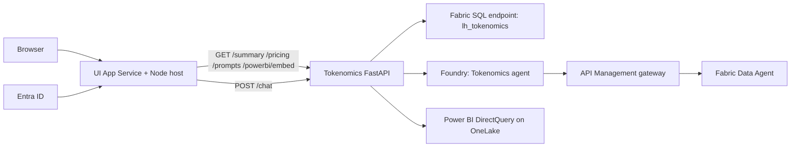
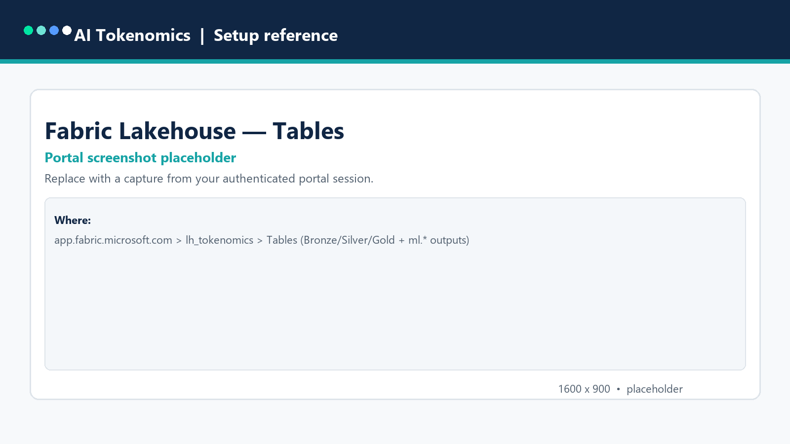
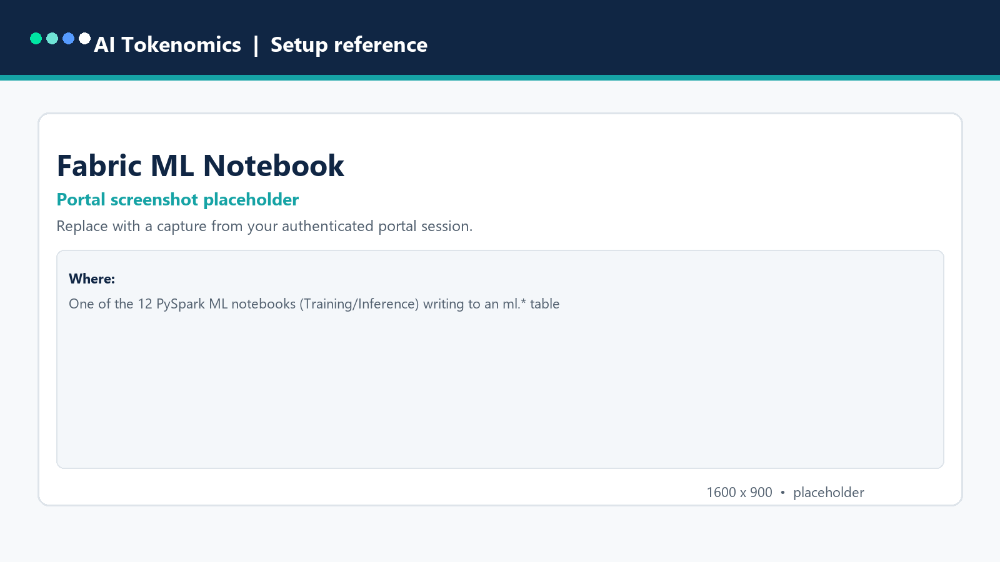
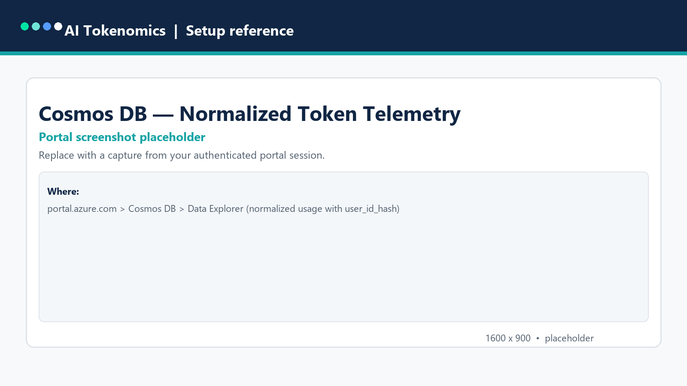
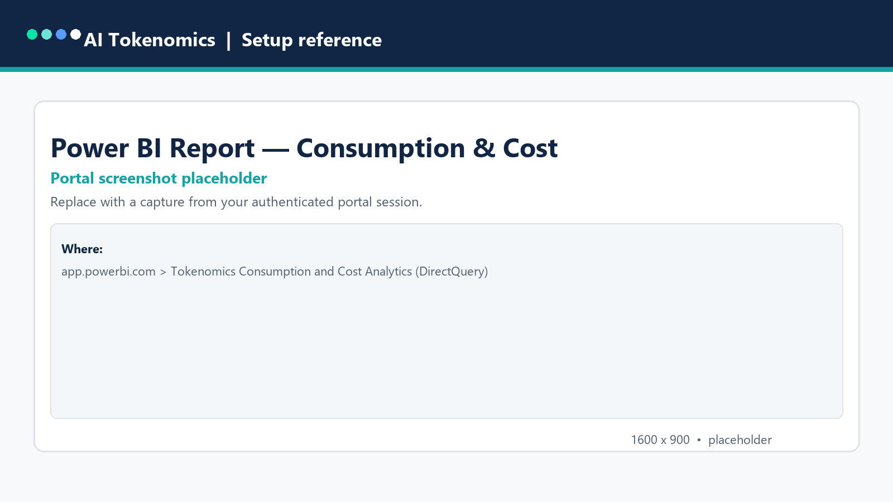
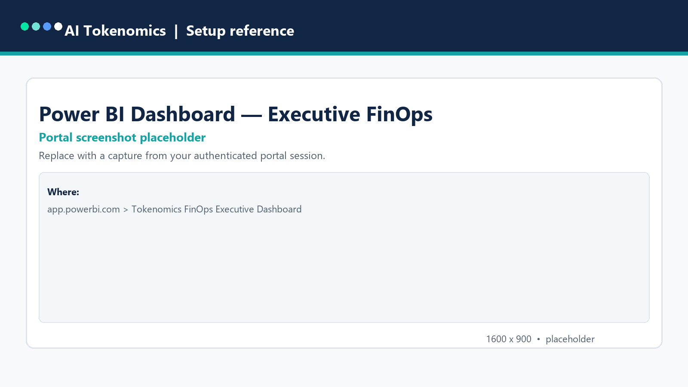
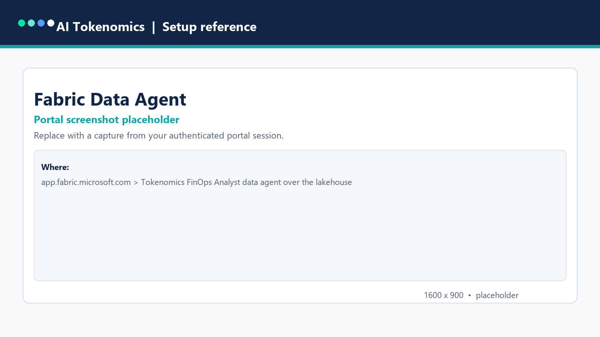
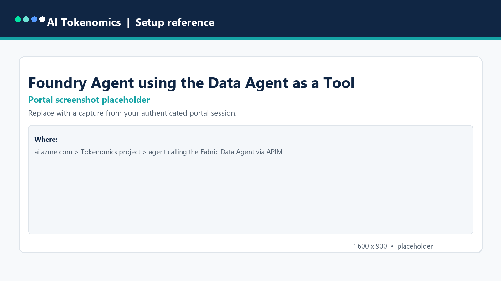
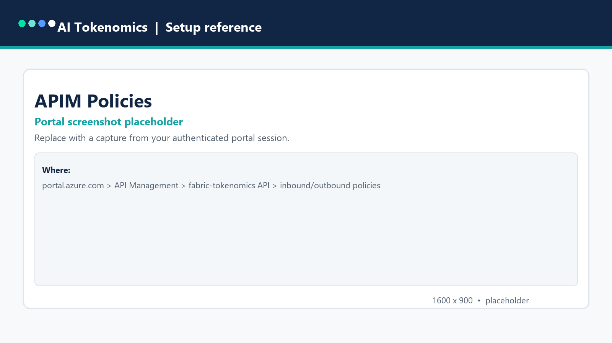

# Multi-Cloud AI Tokenomics & FinOps — Setup Guide

Use this checklist to stand up the **Multi-Cloud AI Tokenomics & FinOps platform** in your own Azure
environment. Replace every `<placeholder>` with your own value; **do not reuse the sample tenant,
subscription, accounts, workspace, or resource names** found in the source repository configuration.

**Baseline:** Windows PowerShell 7, Python 3.13, Node.js 22 LTS, an Azure **App Service** for the UI, a
**Microsoft Fabric** capacity + workspace, a **Microsoft Foundry** project (`Tokenomics`), and an
**API Management** gateway. Reference regions are **West US 2** (Fabric/App Service) and **West US**
(APIM/Foundry). This is a reference application, not a production certification — complete the
[go-live checks](#go-live-checks) before customer production use.

The whole platform is **config-driven** from a single [`config/deployment.json`](https://github.com/csdmichael/FabricIQ-FoundryIQ-CostOps/blob/main/config/deployment.json)
and [`config/tokenomics-prompts.json`](https://github.com/csdmichael/FabricIQ-FoundryIQ-CostOps/blob/main/config/tokenomics-prompts.json).
No values are hard-coded in code.

## Table of Contents

- [Before You Start](#before-you-start)
- [1. Azure Prerequisites](#1-azure-prerequisites)
  - [1a. Microsoft Fabric](#1a-microsoft-fabric)
  - [1b. Power BI](#1b-power-bi)
  - [1c. Microsoft Foundry](#1c-microsoft-foundry)
  - [1d. API Management](#1d-api-management)
  - [1e. Entra ID App Registrations](#1e-entra-id-app-registrations)
  - [1f. App Service Hosting](#1f-app-service-hosting)
  - [1g. Key Vault & Networking](#1g-key-vault--networking)
- [2. Multi-Cloud Pricing & Telemetry](#2-multi-cloud-pricing--telemetry)
- [3. Configuration](#3-configuration)
  - [3a. `config/deployment.json`](#3a-configdeploymentjson)
  - [3b. Prompt library](#3b-prompt-library)
  - [3c. UI runtime config & API app settings](#3c-ui-runtime-config--api-app-settings)
- [4. Deploy and Verify](#4-deploy-and-verify)
  - [PowerShell Run Order](#powershell-run-order)
  - [Run the API and UI](#run-the-api-and-ui)
  - [Local Validation & Tests](#local-validation--tests)
  - [Verification](#verification)
  - [Go-Live Checks](#go-live-checks)
- [References](#references)

## Before You Start

| Prepare | What you need |
| --- | --- |
| Azure access | A subscription, a resource group, an approved region, and permission to create Fabric, App Service, APIM, Foundry, Key Vault, and Entra resources. An authorized administrator grants Azure roles and tenant-wide Graph consent — Contributor alone cannot grant access. |
| Microsoft Fabric | A **Fabric capacity** (F-SKU or trial) in an approved region and rights to create a workspace, Lakehouse, and Data Agent. Power BI (Fabric) tenant settings must permit service principals / embedding where used. |
| Microsoft Foundry | A Foundry resource and project for the FinOps analyst agent, plus a model deployment (for example a chat/model-router deployment) in a region with quota. |
| Product administrators | An Entra administrator to register the API and dashboard applications and consent to delegated Graph / Power BI / Fabric scopes. |
| Source | An authorized copy of the [application repository](https://github.com/csdmichael/FabricIQ-FoundryIQ-CostOps). Review its configuration before running anything — it contains reference-environment values that must be replaced. |
| Workstation | Git, PowerShell 7, Node.js 22 LTS/npm, Python 3.13, Azure CLI, and (optionally) GitHub CLI (`gh`). Chrome or Edge is needed for UI checks. |
| Secret handling | Use Azure Key Vault or protected App Service settings, short expiry, an assigned rotation owner, and a secret manager. Never place tokens, keys, or connection strings in a README, ticket, screenshot, chat, or command history. |



All **Foundry model inference and Data Agent calls** are mediated by the **APIM** policy boundary, with
On-Behalf-Of (OBO) delegated identity carried end-to-end. Power BI reads the **same OneLake tables** via
DirectQuery — there is no data copy.

## 1. Azure Prerequisites

Complete 1a–1g in your approved network. Create the Fabric workspace and Lakehouse first, then the
serving and identity resources; the deployment sequence in [section 4](#4-deploy-and-verify) accounts for
the dependencies.

### 1a. Microsoft Fabric

| Item | Required setup | Verify |
| --- | --- | --- |
| Capacity | A Fabric **capacity** (`<capacity-name>`) in the approved region. | Capacity is active and assigned to your workspace. |
| Workspace | A Fabric **workspace** (`<workspace-name>`) on that capacity. | Visible in the Fabric portal; you have Admin/Member. |
| Lakehouse | A Lakehouse named **`lh_tokenomics`**. | Bronze/Silver/Gold Delta tables are created by the provisioning scripts. |
| Gold fact | `ml.tokenomics_usage_fact` plus the 12 `ml.*` output tables. | Materialized by [`sync-tokenomics-to-fabric.ps1`](https://github.com/csdmichael/FabricIQ-FoundryIQ-CostOps/blob/main/scripts/sync-tokenomics-to-fabric.ps1). |
| Prices (source of truth) | `prices.token_price_history` — effective-dated (SCD-2) token prices. | Costing joins usage to the price effective at each usage date; the API's `/pricing` and `/pricing/consumption` read this schema. |
| Ontology graph (optional, preview) | A Fabric IQ **Ontology / GraphModel** item over `prices.*` and `ml.*`. | Provides a governed semantic/graph layer for agents and cross-domain reasoning. |
| SQL endpoint | The Lakehouse **SQL analytics endpoint** host. | The API reads through this endpoint; capture the host into config. |
| Data Agent | A Fabric **Data Agent** (`Tokenomics FinOps Analyst`) over the Lakehouse + ML tables. | The agent answers natural-language FinOps questions. |

Capture the resulting `workspaceId`, `capacityId`, `lakehouseId`, `sqlEndpointHost`, and `dataAgentId`
into the `fabric` block of `config/deployment.json`.

### 1b. Power BI

| Item | Required setup | Verify |
| --- | --- | --- |
| Semantic model | `Tokenomics FinOps Model` (DirectQuery over the Fabric SQL endpoint). | Published by [`publish-tokenomics-powerbi.ps1`](https://github.com/csdmichael/FabricIQ-FoundryIQ-CostOps/blob/main/scripts/publish-tokenomics-powerbi.ps1). The Price History table reads from `prices.token_price_history`. |
| Reports | `Tokenomics Consumption and Cost Analytics` and `Tokenomics ML Insights`. | Both open on live data. |
| Dashboards | `Tokenomics FinOps Executive Dashboard` and `Tokenomics ML Operations Dashboard`. | Tiles render from the semantic model. |
| Embedding | Tenant settings allow the required embedding / service principal usage. | The UI Power BI viewer embeds the reports for signed-in users. |

Record the report/dashboard IDs and embed URLs in the `powerBi` block of `config/deployment.json`.

### 1c. Microsoft Foundry

| Item | Required setup | Verify |
| --- | --- | --- |
| Resource/project | A Foundry resource and a project named **`Tokenomics`** (reference region **West US**). | Project endpoint resolves and is reachable from an in-network host. |
| Model deployment | A chat/model-router deployment with quota in the project region. | The FinOps analyst agent binds to the deployment. |
| Agent | The **Tokenomics FinOps Analyst** agent that calls the Fabric Data Agent **through APIM**. | Provisioned by [`provision-tokenomics-foundry.py`](https://github.com/csdmichael/FabricIQ-FoundryIQ-CostOps/blob/main/scripts/provision-tokenomics-foundry.py) (run in-network; use `--what-if` to validate). |
| Runtime identity | The API identity has Reader on the Foundry account and project-scoped agent access. | Model discovery and agent invocation succeed. |

### 1d. API Management

| Item | Required setup | Verify |
| --- | --- | --- |
| Service | An APIM service (`<apim-name>`) — reuse an existing one (`createService: false`) or provision. | Gateway URL responds; public network access **Disabled** where required. |
| Tokenomics API | API id/path **`fabric-tokenomics`** fronting the FastAPI service. | Routes `/summary`, `/pricing`, `/prompts`, `/powerbi/embed`, `/health`, `/chat` are reachable with a bearer token. |
| Data Agent MCP | The `fabric-data-agent-mcp` API/route the Foundry agent uses to reach the Fabric Data Agent. | Foundry → APIM → Data Agent calls succeed under OBO. |
| Policies | Rate limits and per-minute model-token limits (`rateLimitCalls`, `modelTokenLimitPerMinute`, `requestTimeoutSeconds`). | Throttling and timeout behave as configured. |

Configure the `apim` block of `config/deployment.json` with your service name, gateway URL, API path, and
product IDs. The UI host proxies `/api/<tokenomicsApiPath>/*` to the APIM gateway (see
[`ui/server.js`](https://github.com/csdmichael/FabricIQ-FoundryIQ-CostOps/blob/main/ui/server.js)).

### 1e. Entra ID App Registrations

| Application | Required setup | Verify |
| --- | --- | --- |
| Tokenomics API (`<api-app>`) | Expose an API with delegated scope **`Fabric.Access`**; grant downstream delegated permissions **`DataAgent.Execute.All`**, **`Lakehouse.Read.All`**, **`SQLEndpoint.Read.All`**. | OBO exchange to Fabric/Data Agent succeeds. |
| Dashboard client (`<dashboard-app>`) | SPA/public client for the UI; delegated Power BI scopes **`Report.Read.All`**, **`Dashboard.Read.All`**, **`Workspace.Read.All`**, and Fabric **`https://api.fabric.microsoft.com/.default`**. | Sign-in and embedded Power BI work for allowed users. |
| Consent | Admin consent for the delegated Graph / Power BI / Fabric scopes above. | No consent prompts block first sign-in. |

Populate the `identity` block of `config/deployment.json`. Restrict early access with
`allowedUserPrincipalName` / `allowedUserObjectIds` while validating.

### 1f. App Service Hosting

| Item | Required setup | Verify |
| --- | --- | --- |
| UI App Service | A Linux/Windows App Service running the Node host ([`ui/server.js`](https://github.com/csdmichael/FabricIQ-FoundryIQ-CostOps/blob/main/ui/server.js)). | `/health` returns `{ "status": "ok" }`. |
| API hosting | Host the FastAPI service (App Service or container) reachable by APIM. | `/health` on the API responds. |
| Managed identity | Assign a managed identity to the API host for Fabric/Foundry/Key Vault access. | Role assignments name the API principal. |

### 1g. Key Vault & Networking

| Item | Required setup | Verify |
| --- | --- | --- |
| Key Vault | Store any provider keys/secrets; the platform retrieves them at runtime (**zero cleartext credentials**). | No secrets appear in config or code. |
| Private networking | Private endpoints and VNet integration for APIM and hosting where required (`publicNetworkAccess: Disabled`). | In-network DNS resolves privately; public access is disabled. |
| User pseudonymization | Confirm SHA-256 `user_id_hash` is applied before persistence into Cosmos/Lakehouse. | No raw user identifiers land in Gold tables. |

## 2. Multi-Cloud Pricing & Telemetry

Model prices are fetched from published provider endpoints, hashed for provenance, and normalized into
effective-dated rate cards. No secrets are required for the anonymous catalogs; supply an API key/OAuth
only for Google Cloud Billing.

| Provider (schema tag) | Pricing source | Auth |
| --- | --- | --- |
| AWS Bedrock (`aws`) | AWS Price List Bulk API | Anonymous |
| GCP Vertex (`gcp`) | Google Cloud Billing Catalog API | API key / OAuth 2.0 |
| Azure OpenAI (`msft`) | Azure Retail Prices API | Anonymous |
| OpenAI Direct (`oai`) | OpenAI pricing snapshot | Curated snapshot |
| Anthropic Claude (`cld`) | Anthropic pricing snapshot | Curated snapshot |

Token telemetry from the five providers (and Foundry via Log Analytics) is seeded/normalized into the
medallion Lakehouse. For a demo, [`seed-tokenomics-data.ps1`](https://github.com/csdmichael/FabricIQ-FoundryIQ-CostOps/blob/main/scripts/seed-tokenomics-data.ps1)
generates synthetic multi-cloud usage.

**Governed price history & refresh.** Normalized prices land in the **`prices.token_price_history`**
table — an effective-dated (SCD-2) history that is the **single source of truth** for costing. A timer-triggered
**pricing Azure Function** (config block `pricingFunction`, hosted on the same App Service plan as the API)
calls the provider pricing sources on a schedule, diffs against the current prices, and appends only changed
rows to `prices.token_price_history` in OneLake via managed identity. The API's `/pricing` returns the current
rate cards and `/pricing/consumption` computes total cost by joining usage to the price effective at each
usage date.

## 3. Configuration

Make these changes in your **copy of the application repository**, before deployment.

### 3a. `config/deployment.json`

Replace the reference values with your own in each block:

| Block | Replace |
| --- | --- |
| `azure` | `tenantId`, `subscriptionId`, `resourceGroup`, `location`. |
| `fabric` | Workspace/capacity/lakehouse IDs, `sqlEndpointHost`, `dataAgentId`, and the semantic model / report / dashboard names. |
| `powerBi` | Workspace, semantic model, report, and dashboard IDs and embed URLs. |
| `apim` | Service name, `gatewayUrl`, `tokenomicsApiPath`, product IDs, and rate/limit policy values. Set `createService` and `publicNetworkAccess` for your environment. |
| `identity` | API and dashboard app display names/IDs, delegated scopes, downstream delegated permissions, and the allow-list (`allowedUserPrincipalName`, `allowedUserObjectIds`). |
| `network` | VNet/subnet resource IDs and private-endpoint subnet for your approved network. |
| `foundry` | Foundry project name/location and model deployment for the agent. |
| `dashboardApi` | API schema/table names including `pricesSchema` (`prices`) and `pricesTable` (`token_price_history`), window sizes, and CORS origins. |
| `pricingFunction` | Pricing Azure Function app name, the existing App Service plan to reuse, storage account, and the refresh `schedule` (CRON). |
| `ui` | UI hostname / App Service name. |
| `tags` | Cost-center and ownership tags for provisioned resources. |

None of these values is a secret; secrets belong in Key Vault or protected App Service settings.

### 3b. Prompt library

Review [`config/tokenomics-prompts.json`](https://github.com/csdmichael/FabricIQ-FoundryIQ-CostOps/blob/main/config/tokenomics-prompts.json)
to tailor the Data Agent **Saved Prompt Library** categories (executive summary, anomalies & overruns,
model optimization, prompt quality, quota & capacity, **Model Pricing**, and **Business Ontology**). These
drive the Data Agent Chat screen.

### 3c. UI runtime config & API app settings

The UI reads a small runtime config at [`ui/public/runtime-config.json`](https://github.com/csdmichael/FabricIQ-FoundryIQ-CostOps/blob/main/ui/public/runtime-config.json):

| Key | Value |
| --- | --- |
| `apiBaseUrl` | The API base (typically the UI host's `/api/fabric-tokenomics` proxy path). |
| `tenantId` / `clientId` | The Entra tenant and the **dashboard client** app registration ID. |
| `scope` | The API delegated scope (`api://<api-app>/Fabric.Access`). |
| `powerBiScope` | `https://analysis.windows.net/powerbi/api/.default`. |
| `environment` | A label such as `Production` (not `Unconfigured`). |

Set these environment variables on the **UI host** (see `ui/server.js`):

| Variable | Value |
| --- | --- |
| `APIM_GATEWAY_HOST` | Your APIM gateway host (no scheme). |
| `APIM_TOKENOMICS_API_PATH` | `fabric-tokenomics` (or your API path). |
| `PORT` | Host port (default `8080`). |

The Node host only proxies the allow-listed routes and requires a bearer token; update the
Content-Security-Policy `connect-src` in `ui/server.js` to your API/Power BI/login hosts if they differ.

## 4. Deploy and Verify

### PowerShell Run Order

Run from the repository root after configuration. Provisioning steps that reach Fabric/Foundry must run
from a network that can reach those endpoints.

```powershell
# 1. Provision the Fabric workspace, Lakehouse, and dataflows
pwsh scripts/provision-tokenomics-fabric.ps1

# 2. Seed multi-cloud synthetic ingestion data (demo)
pwsh scripts/seed-tokenomics-data.ps1 -RepositoryCommit $(git rev-parse HEAD)

# 3. Synchronize and materialize Delta tables in OneLake
pwsh scripts/sync-tokenomics-to-fabric.ps1

# 4. Publish the Power BI semantic model, reports, and dashboards
pwsh scripts/publish-tokenomics-powerbi.ps1

# 5. Provision the Foundry "Tokenomics" project + FinOps Analyst agent
#    (Foundry agent -> APIM -> Fabric Data Agent). Run in-network.
python scripts/provision-tokenomics-foundry.py            # or --what-if to validate

# 6. Build and deploy the Angular/Ionic CostOps UI
pwsh scripts/build-ui.ps1
```

Identity and APIM wiring can be applied with [`provision-identity.ps1`](https://github.com/csdmichael/FabricIQ-FoundryIQ-CostOps/blob/main/scripts/provision-identity.ps1)
and the higher-level [`deploy.ps1`](https://github.com/csdmichael/FabricIQ-FoundryIQ-CostOps/blob/main/scripts/deploy.ps1); review each script before running.

### Run the API and UI

```powershell
# Tokenomics FastAPI service (live Fabric Lakehouse data)
pip install -r api/requirements.txt
uvicorn app.main:app --app-dir api --port 8080

# UI host (serves the built UI and proxies /api/* to APIM)
$env:APIM_GATEWAY_HOST = "<apim-gateway-host>"
$env:APIM_TOKENOMICS_API_PATH = "fabric-tokenomics"
node ui/server.js        # from a folder containing the built 'browser' output
```

### Local Validation & Tests

```powershell
# Validate contracts, Bicep, Terraform, UI build, and Python scripts
pwsh scripts/validate.ps1 -DeploymentReady

# UI unit tests (headless)
npm test --prefix ui -- --watch=false

# Data generator / Power BI generator tests
npm test --prefix scripts/tokenomics

# Python Delta schema checks
python scripts/test/test_delta_schema.py
python scripts/test/test_onelake_swap.py
```

### Verification

| Check | Expected |
| --- | --- |
| API health | `GET /health` returns `{ "status": "ok" }`. |
| UI host health | `GET /health` on the UI host returns `{ "status": "ok" }`. |
| Overview screen | Signs in, loads governed telemetry, and shows KPI cards and trend charts. |
| Pricing screen | Live rate cards render across all five providers. |
| Power BI screen | Embedded reports/dashboards load for the signed-in user. |
| ML Insights screen | The 12 ML use-case outputs render. |
| Data Agent Chat | A saved prompt returns a governed answer via Foundry → APIM → Data Agent. |

### Go-Live Checks

- Public network access **disabled** for APIM/hosting where required; private endpoints validated.
- All secrets in Key Vault or protected settings; **no** secrets in config, code, or history.
- SHA-256 `user_id_hash` applied before persistence; no raw identifiers in Gold tables.
- Access allow-list reviewed; broaden `allowedUser*` only after validation.
- Rate limits, per-minute model-token limit, and request timeout tuned for expected load.
- `runtime-config.json` `environment` is set to a real label (not `Unconfigured`).
- Reference tenant/subscription/workspace values fully replaced with customer values.

## Reference Screenshots

The following captures illustrate the provisioned platform end to end. They are **placeholders** — replace
each file in [`images/`](./images) with a capture from your own authenticated portal session (the portals
require interactive sign-in and are not public).

### Data & lakehouse


*Fabric Lakehouse `lh_tokenomics` — Bronze/Silver/Gold Delta tables and the 12 `ml.*` output tables.*


*One of the 12 PySpark ML notebooks (Training/Inference) writing to an `ml.*` output table.*


*Azure Cosmos DB Data Explorer — normalized multi-cloud token telemetry with `user_id_hash` pseudonymization.*

### Serving & intelligence


*Power BI `Tokenomics Consumption and Cost Analytics` report (DirectQuery on the governed lakehouse).*


*Power BI `Tokenomics FinOps Executive Dashboard`.*


*Fabric Data Agent (`Tokenomics FinOps Analyst`) over the Lakehouse and ML tables.*


*Microsoft Foundry `Tokenomics` agent calling the Fabric Data Agent as a governed tool through APIM.*

### Governance


*API Management — inbound/outbound policies on the `fabric-tokenomics` API (rate limits, token limits, OBO).*

## References

- [Application repository](https://github.com/csdmichael/FabricIQ-FoundryIQ-CostOps)
- [Platform documentation](https://github.com/csdmichael/FabricIQ-FoundryIQ-CostOps-Docs)
- [User guide](../user-guide/README.md)
- [Business case](../business-case/business-case.md)
- [Microsoft Fabric documentation](https://learn.microsoft.com/fabric/)
- [Microsoft Fabric Data Agent overview](https://learn.microsoft.com/fabric/data-science/data-agent-overview)
- [Power BI DirectQuery on Fabric Lakehouse](https://learn.microsoft.com/power-bi/connect-data/desktop-directquery-about)
