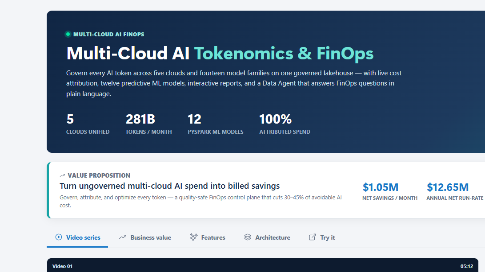
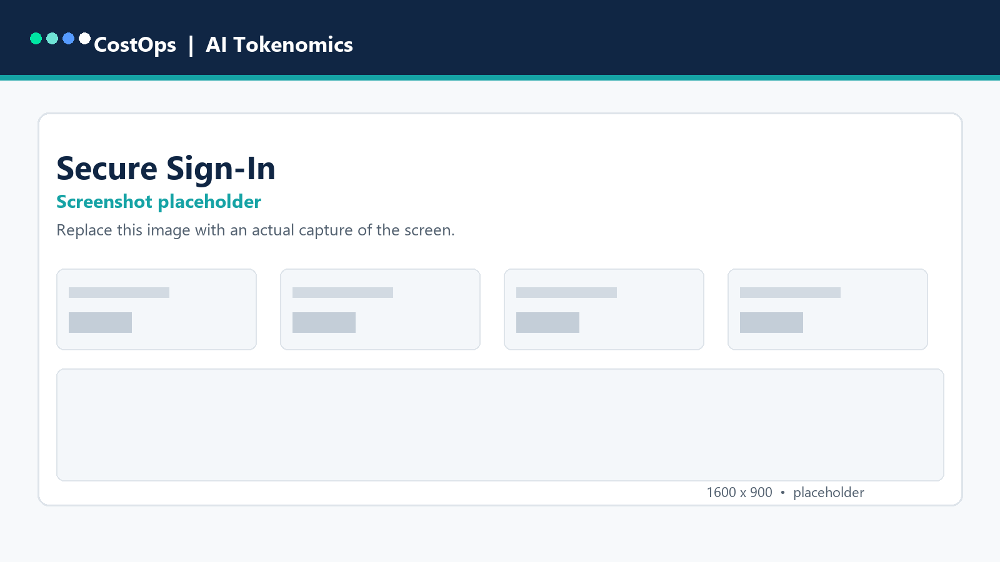
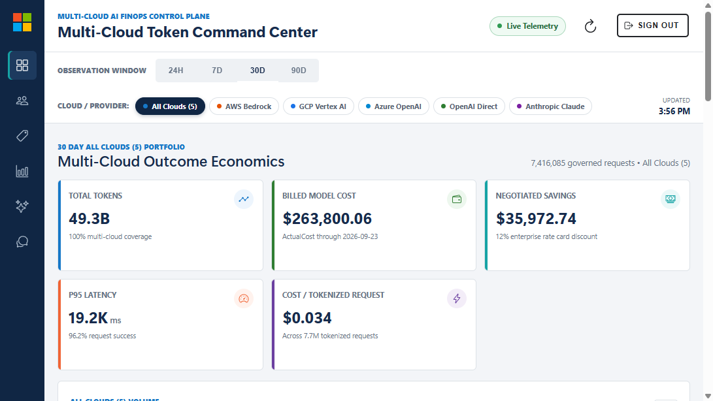
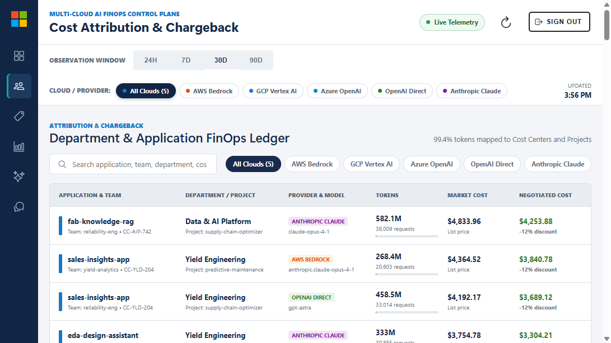
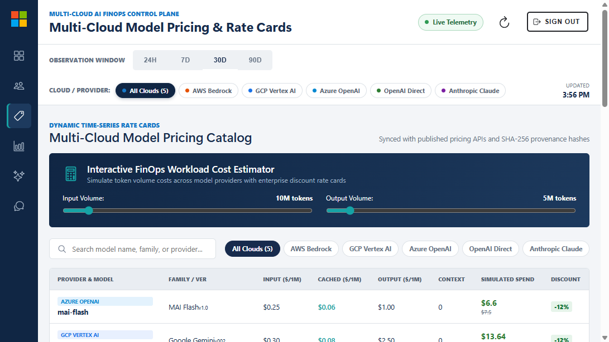
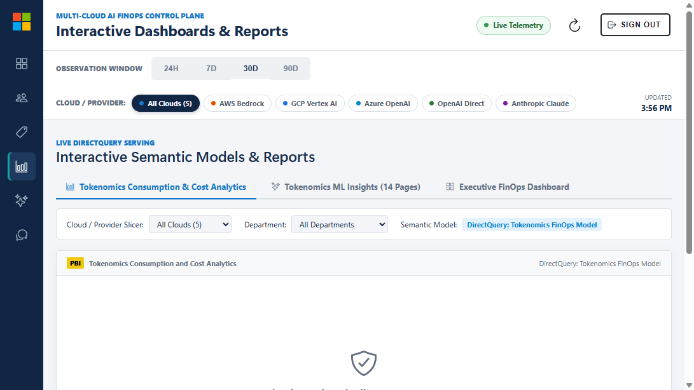
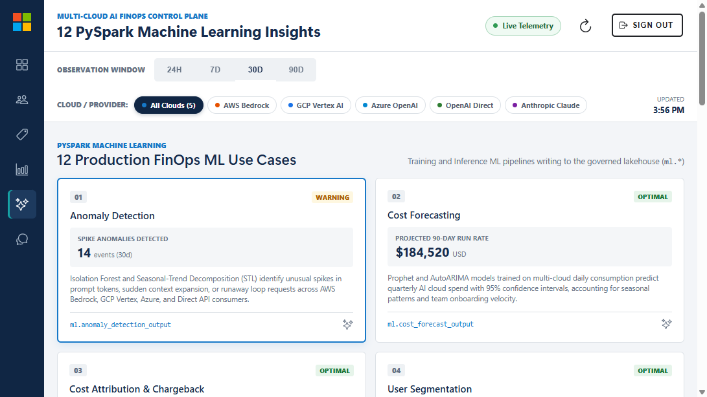
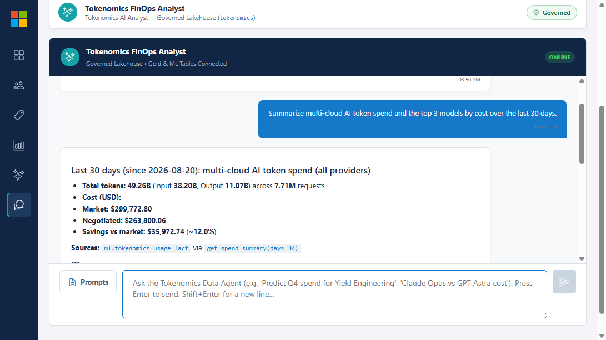
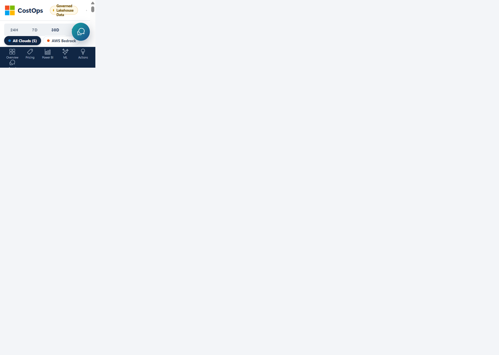

# Multi-Cloud AI Tokenomics & FinOps — CostOps Portal — User Guide

**Michael Yaacoub  |  Sr Solution Engineer**  
Version 1.0  •  September 2026

> Screenshots in this guide are live captures of the CostOps portal running on governed multi-cloud data. The sign-in screen is represented by a labeled placeholder because the portal signs in silently via SSO.

## Introduction

The CostOps portal is the governed control plane for multi-cloud AI FinOps. It unifies AI token telemetry and pricing from five clouds onto one Microsoft Fabric lakehouse, attributes 100% of spend, runs twelve predictive ML models, and answers plain-language FinOps questions through a Data Agent. This guide walks through every screen and how to use it.

## Navigation at a Glance

| Screen | Icon | What it is for |
| --- | --- | --- |
| Overview | grid | Multi-cloud KPI command center and trends. |
| Allocation | people | Cost attribution and chargeback by team, project, BU. |
| Model Pricing | pricetag | Live rate cards and a cost calculator across providers. |
| Power BI Reports | bar-chart | Embedded executive and ML dashboards. |
| 12 ML Insights | sparkles | Outputs of the twelve PySpark ML use cases. |
| Action Center | bulb | Data-driven, reviewable actions from ML outputs (the closed loop). |
| Data Agent Chat | chatbubbles | Ask FinOps questions in natural language. |
| ML Guide | help-circle | Reference for the 12 algorithms: features, output, how to act. |
| Showcase | trending-up | Business value, architecture, and try-it links. |

## 1. Business Value Showcase

The Showcase is a standalone, unauthenticated landing experience that presents the platform's value proposition, business case, features, architecture, and try-it links. It is the best place to start a briefing.

**How to use it**

- Open the Showcase from the portal or directly at the /showcase route.
- Read the value-proposition gadget at the top, then select Explore the business value to drill into the model.
- Use the tabs — Video series, Business value, Features, Architecture, Try it — to move between sections.
- In Try it, open the user guide, setup guide, and executive business case, or draft a source-access email.

**Key elements**

- Value proposition gadget with headline KPIs and a drill-down button.
- Business value tab: spend scenarios ($1M / $5M / $10M per month), savings levers, and auditable assumptions.
- Architecture tab: the end-to-end architecture diagram.

## 2. Secure Sign-In

Access to the governed dashboards requires enterprise sign-in. Identity follows the user (On-Behalf-Of), so every downstream query to Fabric and the Data Agent runs with the signed-in user's permissions.

**How to use it**

- Select Sign in and authenticate with your organizational (Entra ID) account.
- Approve any one-time consent prompt for the delegated Power BI and Fabric scopes.
- Once the banner shows Tenant Connected, the dashboards load live governed telemetry.
- Use Sign out (top-right) to end the session on a shared device.

**Key elements**

- Entra ID sign-in with delegated, least-privilege scopes.
- Tenant Connected status indicator and Sign out control.

## 3. Token Command Center (Overview)

The Overview is the multi-cloud KPI command center. It summarizes tokens, cost, savings, latency, and operational health across all five providers for the selected window.

**How to use it**

- Scan the KPI cards: Total Tokens, Billed Cost, Negotiated Savings, P95 Latency, and Cost per Request.
- Use the Observation window (24H / 7D / 30D / 90D) to change the time range.
- Use the Cloud / Provider filter to focus on All Clouds or a single provider (AWS, GCP, Azure, OpenAI, Claude).
- Review the volume and cost trend charts, provider market share, and operational health meters.

**Key elements**

- Multi-cloud KPI cards with negotiated-savings and latency.
- Volume and cost trend charts; provider market-share breakdown.
- Observation-window tabs and provider filter chips.

## 4. Cost Allocation & Chargeback

Allocation attributes every token and dollar to the organization: business unit, department, team, project, and cost center — chargeback-ready and reconciled to negotiated rates.

**How to use it**

- Choose the attribution dimension (team, project, department, or business unit).
- Read the percentage breakdown and budget tracking for each entity.
- Compare market cost against negotiated cost to quantify savings per group.
- Export or hand off the allocation view for chargeback and budget reviews.

**Key elements**

- Cross-team, project, department, and BU attribution tables.
- Percentage breakdown and budget tracking per entity.

## 5. Multi-Cloud Model Pricing

The Model Pricing catalog shows live, effective-dated rate cards across AWS Bedrock, GCP Vertex AI, Azure OpenAI, OpenAI Direct, and Anthropic Claude, with a built-in cost calculator.

**How to use it**

- Browse rate cards by provider and model family; each rate is SHA-256 provenanced and effective-dated.
- Compare input, cached-input, cache-write, and output token prices per million.
- Toggle market vs negotiated pricing to see enterprise-discount impact.
- Use the calculator to estimate cost for a given token volume and model.

**Key elements**

- Live rate cards for all five providers.
- Market vs negotiated comparison and a pricing calculator.

> **Source of truth:** rate cards are served from the governed `prices.token_price_history` table in Fabric — an effective-dated (SCD-2) price history. The API also computes total consumption cost by joining each usage event to the price that was effective on its date, so cost is always reconciled to the governed price at time of use.

## 5b. Action Center — Closing the FinOps Loop

The Action Center turns ML and analytics outputs into concrete, reviewable **actions** — it closes the loop between insight and change. Every plan is derived live from the governed `ml.*_output` tables; nothing is hard-coded.

**How to use it**

- Review the projected annual and monthly impact summary at the top.
- Filter plans by category: model switching, token/rate limits, quota reallocation, throttle guardrails, prompt efficiency, and chargeback.
- Open a plan to see its source algorithm, a **current → proposed** change preview (for example an APIM `rate-limit-by-key` change or a model swap), the projected impact, and confidence.
- Export the action plan as JSON to hand to a change/approval workflow.

**Key elements**

- Impact summary (annual/monthly savings and cost-avoidance).
- Per-plan current-vs-proposed change previews tied to the source ML output.
- Category filters and one-click plan export.

## 6. Power BI Reports & Dashboards

The Power BI screen embeds the governed executive and ML reports built directly on OneLake via DirectQuery — the same source of truth as the API and Data Agent, with no data copy.

**How to use it**

- Select a report or dashboard: Consumption & Cost Analytics, ML Insights, or the executive/ML dashboards.
- Apply the date/time, department, and provider slicers to focus the view.
- Drill through the multi-level matrices (User > Model Family > Provider > Model > Version).
- Use in-report export where enabled to share a snapshot.

**Key elements**

- Embedded DirectQuery reports and service dashboards.
- Date, department, and provider slicers with drill-through.

## 7. 12 ML Insights

This screen visualizes the outputs of the twelve PySpark ML use cases — from anomaly detection and cost forecasting to model optimization and quota management.

**How to use it**

- Select an ML use case to view its latest scored output.
- Review anomaly flags, budget-overrun risk probabilities, and prompt-quality scores.
- Inspect model-optimization downgrade savings and quota recommendations.
- Use the insights to prioritize quality-safe optimization actions.

**Key elements**

- Interactive tiles for all 12 ML use cases (ml.* outputs).
- Risk probabilities, savings estimates, and recommendations.

## 8. Data Agent Chat & Prompt Library

The Data Agent Chat turns the governed lakehouse into plain-language answers. It calls the Fabric Data Agent through the APIM gateway under the signed-in user's identity, backed by a configurable Saved Prompt Library.

**How to use it**

- Pick a saved prompt from a category, or type your own FinOps question.
- Read the structured answer, including SQL/DAX breakdowns and recommendations.
- Refine with follow-up questions; the agent keeps conversational context.
- Export or copy the conversation for sharing where enabled.

**Key elements**

- Conversational FinOps analyst over governed Delta tables.
- Categorized Saved Prompt Library: executive, anomalies, optimization, quality, quota, **Model Pricing**, and **Business Ontology**.

**Pricing & ontology questions**

The agent can now answer **pricing** questions from the governed `prices` schema — current rate cards, when a model's price changed (effective-dated history), and total consumption cost computed from the price effective at each usage date. It can also answer **business-context / ontology** questions grounded in the ontology (business classes, their properties, and relationships such as *PricePoint pricesTokensOf Model* and *ML Insight recommends Action*). Try the "Model Pricing" and "Business Ontology" prompt categories.

## 9. ML Guide (Help)

The ML Guide is a reference for all twelve algorithms. For each one it explains, in plain language, what it does, the technique it uses, its highest-impact features, the output table it writes, and — crucially — how to turn that output into action.

**How to use it**

- Expand any algorithm to read its explanation, top-impact features, and output.
- Follow the "How to use it (close the loop)" note to see the recommended action.
- Use the shortcut button to jump straight to the matching plans in the Action Center.

**Key elements**

- All 12 algorithms with technique, features, output, and how-to-act guidance.
- Direct links from each algorithm to its Action Center category.

## Tips

- Every query runs under your identity (On-Behalf-Of); you only see data you are authorized to see.
- Provider and time-window filters on the Overview carry the context you use across the dashboards.
- Savings are quality-safe: approve optimizations, then reconcile realized savings against invoices.
- The Showcase Business value tab is illustrative planning — replace figures with your own actuals.

## Troubleshooting

The portal now shows the **real reason** for a failure plus a **"What to do"** remediation and a collapsible technical detail, instead of a generic error. Common cases:

| Symptom (shown reason) | What to do |
| --- | --- |
| "Microsoft Fabric capacity is paused or resuming." | Resume the Fabric capacity (Azure portal → Fabric capacity → Resume, or `az fabric capacity resume`); a cold start takes ~30–60s, then Retry. |
| "The analytics API is not configured yet." | Publish `runtime-config.json` with the API base URL and sign in. |
| "The analytics API could not authenticate to Fabric." | Sign in again and confirm the API's managed identity has access to the Fabric workspace SQL endpoint. |
| "The Fabric SQL query timed out." / "…is unreachable." | The capacity may be resuming or under load; wait a few seconds and Retry (the app also retries transient errors automatically and fails fast via a circuit breaker to avoid long hangs). |
| Power BI report does not embed | Verify Power BI embedding tenant settings and that your account has report access. |
| Data Agent returns no answer | Check Foundry → APIM → Fabric Data Agent connectivity and your delegated permissions. |
| Empty KPI cards | Widen the observation window or clear the provider filter; confirm the lakehouse has data. |

## More

- [Setup & deployment guide](../setup/README.md)
- [Business case](../business-case/business-case.md)
- [Value proposition](../business-case/value-proposition.md)
- [Application repository](https://github.com/csdmichael/FabricIQ-FoundryIQ-CostOps)
